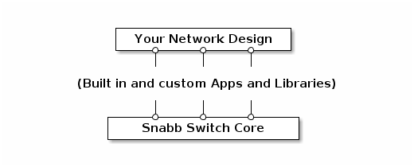
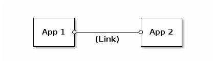

# Introduction

*Snabb Switch* is an extensible, virtualized, Ethernet networking
toolkit.  With Snabb Switch you can implement networking applications
using the *Lua language*. Snabb Switch includes all the tools you need to
quickly realize your network designs and its really fast too!
Furthermore, Snabb Switch is extensible and encourages you to grow the
ecosystem to match your requirements.



The Snabb Switch Core forms a runtime environment (*engine*) which
executes your *design*. A design is simply a Lua script used to drive the
Snabb Switch stack, you can think of it as your top-level "main" routine.

In order to add functionality to the Snabb Switch stack you can load
modules into the Snabb Switch engine. These can be Lua modules as well as
native code objects. We differentiate between two classes of modules,
namely libraries and *Apps*. Libraries are simple collections of program
utilities to be used in your designs, apps or other libraries, just as
you might expect. Apps, on the other hand, are code objects that
implement a specific interface, which is used by the Snabb Switch engine
to organize an *App Network*.



Usually, a Snabb Switch design will create a series of apps, interconnect
these in a desired way using *links* and finally pass the resulting app
network on to the Snabb Switch engine. The engine's job is to:

 * Pump traffic through the app network
 * Keep the app network running (e.g. restart failed apps)
 * Report on the network status


# Snabb Switch API

The core modules defined below  can be loaded using Lua's `require`. For
example:

```
local config = require("core.config")

local c = config.new()
...
```

## App

An *app* is an isolated implementation of a specific networking
function. For example, a switch, a router, or a packet filter.

Apps receive packets on *input ports*, perform some processing, and
transmit packets on *output ports*. Each app has zero or more input and
output ports. For example, a packet filter may have one input and one
output port, while a packet recorder may have only an input port. Every
app must implement the interface below. Methods which may be left
unimplemented are marked as "optional".

— Method **myapp:new** *arg*

*Required*. Create an instance of the app with a given argument *arg*.
`Myapp:new` must return an instance of the app. The handling of *arg* is
up to the app but it is encouraged to use `core.config`'s `parse_app_arg`
to parse *arg*.


— Field **myapp.input**

— Field **app.output**

Tables of named input and output links.  These tables are initialized by
the engine for use in processing and are *read-only*.


— Method **myapp:pull**

*Optional*. Pull packets into the network.

For example: Pull packets from a network adapter into the app network by
transmitting them to output ports.


— Method **myapp:push**

*Optional*. Push packets through the system.

For example: Move packets from input ports to output ports or to a
network adapter.


— Method **myapp:relink**

*Optional*. React to a changes in input/output links (`app.input` and
`app.output`). This method is called after a link reconfiguration but
before the next packets are processed.


— Method **myapp:reconfig** *arg*

*Optional*. Reconfigure the app with a new *arg*. If this method is not
implemented the app instance is discarded and a new instance is created.


— Method **myapp:report**

*Optional*. Print a report of the current app status.


— Field **myapp.zone**

*Optional*. Name of the LuaJIT *profiling zone* used for this app
(descriptive string). The default is the module name.


## Config (core.config)

A *config* is a description of a packet-processing network. The network
is a directed graph. Nodes in the graph are *apps* that each process
packets in a specific way. Each app has a set of named input and output
*ports*—often called *rx* and *tx*. Edges of the graph are unidirectional
*links* that carry packets from an output port to an input port.

The config is a purely passive data structure. Creating and
manipulating a config object does not immediately affect operation.
The config has to be activated using `engine.configure`.

— Function **config.new**

Creates and returns a new empty configuration.


— Function **config.app** *config*, *name*, *class*, *arg*

Adds an app of *class* with *arg* to the *config* where it will be
assigned to *name*.

Example:

```
config.app(c, "nic", Intel82599, {pciaddr = "0000:00:00.0"})
```


— Function **config.link** *config*, *linkspec*

Add a link defined by *linkspec* to the config *config*. *Linkspec* must
be a string of the format

```
app_name1.output_port->app_name2.input_port
```

where `app_name1` and `app_name2` are names of apps in *config* and
`output_port` and `input_port` are valid output and input ports of the
referenced apps respectively.

Example:

```
config.link(c, "nic1.tx->nic2.rx")
```


## Engine (core.app)

The *engine* executes a config by initializing apps, creating links, and
driving the flow of execution. The engine also performs profiling and
reporting functions. It can be reconfigured during runtime. Within Snabb
Switch scripts the `core.app` module is bound to the global `engine`
variable.

— Function **engine.configure** *config*

Configure the engine to use a new config *config*.


— Function **engine.main** *options*

Run the Snabb Switch engine. *Options* is a table of key/value pairs. The
following keys are recognized:

 * `duration` - Duration in seconds to run the engine for (as a floating
   point number). If this is set you cannot supply `done`.
 * `done` - A function to be called repeatedly by `engine.main` until it
   returns `true`. Once it returns `true` the engine will be stopped and
   `engine.main` will return. If this is set you cannot supply
   `duration`.
 * `report` - A table which configures the report printed before
   `engine.main()` returns. The keys `showlinks` and `showapps` can be
   set to boolean values to force or suppress link and app reporting
   individually. By default `engine.main()' will report on links but not
   on apps.
 * `no_report` - A boolean value. If `true` no final report will be
   printed.


— Function **engine.now**

Returns monotonic time in seconds as a floating point number. Suitable
for timers.


## Link (core.link)

A *link* is a [ring buffer](http://en.wikipedia.org/wiki/Circular_buffer)
used to store packets between apps. Links can be treated either like
arrays—accessing their internal structure directly—or as streams of
packets by using their API functions.

— Function **link.empty** *link*

Predicate used to test if a link is empty. Returns true if *link* is
empty and false otherwise.


— Function **link.full** *link*

Predicate used to test if a link is full. Returns true if *link* is full
and false otherwise.


— Function **link.receive** *link*

Returns the next available packet (and advances the read cursor) on
*link*. If the link is empty an error is signaled.


— Function **link.transmit** *link*, *packet*

Transmits *packet* onto *link*. If the link is full *packet* is dropped
(and the drop counter increased).


— Function **link.stats** *link*

Returns a structure holding ring statistics for the *link*:

 * `txbytes`, `rxbytes`: Counts of transferred bytes.
 * `txpackets`, `rxpackets`: Counts of transferred packets.
 * `txdrop`: Count of packets dropped due to ring overflow.


## Packet (core.packet)
   
A *packet* is a data structure describing one of the network packets that
is currently being processed. The packet is used to explicitly manage the
life cycle of the packet. Packets are explicitly allocated and freed by
using `packet.allocate` and `packet.free`. When a packet is received
using `link.receive` its ownership is acquired by the calling app. The
app must then ensure to either transfer the packet ownership to another
app by calling `link.transmit` on the packet or free the packet using
`packet.free`. Apps may only use packets they own, e.g. packets that have
not been transmitted or freed. The number of allocatable packets is
limited by the size of the underlying "freelist", e.g. a pool of unused
packet objects from and to which packets are allocated and freed.

— Function **packet.allocate**

Returns a new empty packet. An an error is raised if there are no packets
left on the freelist.

— Function **packet.free** *packet*

Frees *packet* and puts in back onto the freelist.

— Function **packet.data** *packet*

Returns a pointer to the payload of *packet*.

— Function **packet.length** *packet*

Returns the payload length of *packet*.

— Function **packet.clone** *packet*

Returns an exact copy of *packet*.

— Function **packet.append** *packet*, *pointer*, *length*

Appends *length* bytes starting at *pointer* to the end of *packet*. An
error is raised if there is not enough space in *packet* to accomodate
*length* additional bytes.

— Function **packet.prepend** *packet*, *pointer*, *length*

Prepends *length* bytes starting at *pointer* to the front of
*packet*. An error is raised if there is not enough space in *packet* to
accomodate *length* additional bytes.

— Function **packet.shiftleft** *packet*, *length*

Truncates *packet* by *length* bytes from the front.

— Function **packet.from_pointer** *pointer*, *length*

Allocate packet and fill it with *length* bytes from *pointer*.

— Function **packet.from_string** *string*

Allocate packet and fill it with the contents of *string*.


## Memory (core.memory)

Snabb Switch does two things specially when it comes to memory: It
runs with a fixed physical memory map and it allocates *huge pages*
from the operating system.

Running with a fixed memory map means that every virtual address in the
Snabb Switch process has a fixed *physical address* in the RAM
chips. This means that we are always able to convert from a virtual
address in our process to a physical address that other hardware (for
example, a network card) can use for DMA.

Huge pages (also known as *HugeTLB pages*) are how we allocate large
amounts of contiguous memory, typically 2MB at a time. Hardware devices
sometimes require this, for example a network card's *descriptor ring*
may require a list of pointers to available buffers in physical memory.

— Variable **memory.chunks**

List of all allocated huge pages. Read-only. Each huge page is
represented by a table with the following keys:

* `pointer` - Virtual address
* `physical` - Physical address
* `size` -  Size in bytes
* `used` - Bytes used

— Variable **memory.dma_min_addr**

— Variable **memory.dma_max_addr**

Lowest and highest addresses of valid DMA memory. Useful information for
creating memory maps. Read-only.

— Variable **memory.huge_page_size**

Size of a single huge page in bytes. Read-only.

— Variable **huge_page_bits**

Number of address bits per huge page. Read-only.

— Function **memory.dma_alloc** *bytes*

Allocate *bytes* of DMA-friendly memory. Returns virtual memory pointer,
physical address, and actual size.

— Function **memory.virtual_to_physical** *virtual_address*

Returns the physical address of memory at *virtual_address*.


## Lib (core.lib)

The `core.lib` module contains miscellaneous utilities.

— Function **lib.equal** *x*, *y*

Predicate to test if *x* and *y* are structurally similar (isomorphic).

— Function **lib.can_open** *filename*, *mode*

Predicate to test if file at *filename* can be successfully opened with
*mode*.

— Function **lib.can_read** *filename*

Predicate to test if file at *filename* can be successfully opened for
reading.

— Function **lib.can_write** *filename*

Predicate to test if file at *filename* can be successfully opened for
writing.

— Function **lib.readcmd** *command*, *what*

Runs Unix shell *command* and returns *what* of its output. *What* must
be a valid argument to `file:read`.

— Function **lib.readfile** *filename*, *what*

Reads and returns *what* from file at *filename*. *What* must be a valid
argument to `file:read`.

— Function **lib.writefile** *filename*, *value*

Writes *value* to file at *filename* using `file:write`. Returns the
value returned by `file:write`.

— Function **lib.readlink** *filename*

Returns the true name of symbolic link at *filename*.

— Function **lib.dirname** *filename*

Returns the `dirname(3)` of *filename*.

— Function **lib.basename** *filename*

Returns the `basename(3)` of *filename*.

— Function **lib.firstfile** *directory*

Returns the filename of the first file in *directory*.

— Function **lib.firstline** *filename*

Returns the first line of file at *filename* as a string.

— Function **lib.files_in_directory** *directory*

Returns an array of filenames in *directory*.

— Function **lib.load_string** *string*

Evaluates and returns the value of the Lua expression in *string*.

— Function **lib.load_conf** *filename*

Evaluates and returns the value of the Lua expression in file at
*filename*.

— Function **lib.store_conf** *filename*, *value*

Writes *value* to file at *filename* as a Lua expression. Supports
tables, strings and everything that can be readably printed using
`print`.

— Function **lib.bits** *bitset*, *basevalue*

Returns a bitmask using the values of *bitset* as indexes. The keys of
*bitset* are ignored (and can be used as comments).

Example:

```
bits({RESET=0,ENABLE=4}, 123) => 1<<0 | 1<<4 | 123
```

— Function **lib.bitset** *value*, *n*

Predicate to test if bit number *n* of *value* is set.

— Function **lib.bitfield** *size*, *struct*, *member*, *offset*,
*nbits*, *value*

Combined accesor and setter function for bit ranges of integers in cdata
structs. Sets *nbits* (number of bits) starting from *offset* to
*value*. If *value* is not given the current value is returned.

*Size* may be one of 8, 16 or 32 depending on the bit size of the integer
being set or read.

*Struct* must be a pointer to a cdata object and *member* must be the
literal name of a member of *struct*.

Example:

```
local struct_t = ffi.typeof[[struct { uint16_t flags; }]]
-- Assuming `s' is an instance of `struct_t', set bits 4-7 to 0xF:
lib.bitfield(16, s, 'flags', 4, 4, 0xf)
-- Get the value:
lib.bitfield(16, s, 'flags', 4, 4) -- => 0xF
```

— Function **string:split** *pattern*

Returns an iterator over the string split by *pattern*. *Pattern* must be
a valid argument to `string:gmatch`.

Example:

```
for word, sep in ("foo!bar!baz"):split("(!)") do
    print(word, sep)
end

> foo	!
> bar	!
> baz	nil
```

— Function **lib.hexdump** *string*

Returns hexadecimal string for bytes in *string*.

— Function **lib.hexundump** *hexstring*

Returns byte string for *hexstring*.

— Function **lib.comma_value** *n*

Returns a string for decimal number *n* with magnitudes separated by
commas. Example:

```
comma_value(1000000) => "1,000,000"
```

— Function **lib.random_data** *length*

Returns a string of *length* bytes of random data.

— Function **lib.bounds_checked** *type*, *base*, *offset*, *size*

Returns a table that acts as a bounds checked wrapper around a C array of
*type* and *size* starting at *base* plus *offset*. *Type* must be a
ctype and the caller must ensure that the allocated memory region at
*base*/*offset* is at least `sizeof(type)*size` bytes long.

— Function **lib.timer** *s*

Returns a function that accepts no parameters and acts as a predicate to
test if *ns* nanoseconds have elapsed.

— Function **lib.waitfor** *condition*

Blocks until the function *condition* returns a true value.

— Function **lib.waitfor2** *name*, *condition*, *attempts*, *interval*

Repeatedly calls the function *condition* in *interval*
(milliseconds). If *condition* returns a true value `waitfor2`
returns. If *condition* does not return a true value after *attempts*
`waitfor2` raises an error identified by *name*.

— Function **lib.yesno** *flag*

Returns the string `"yes"` if *flag* is a true value and `"no"`
otherwise.

— Function **lib.align** *value*, *size*

Return the next integer that is a multiple of *size* starting from
*value*.

— Function **lib.csum** *pointer*, *length*

Computes and returns the "IP checksum" *length* bytes starting at
*pointer*.

— Function **lib.update_csum** *pointer*, *length*, *checksum*

Returns *checksum* updated by *length* bytes starting at
*pointer*. The default of *checksum* is `0LL`.

— Function **lib.finish_csum** *checksum*

Returns the finalized *checksum*.

— Function **lib.malloc** *etype*

Returns a pointer to newly allocated DMA memory for *etype*.

— Function **lib.deepcopy** *object*

Returns a copy of *object*. Supports tables as well as ctypes.

— Function **lib.array_copy** *array*

Returns a copy of *array*. *Array* must not be a "sparse array".

— Function **lib.htonl** *n*

— Function **lib.htons** *n*

Host to network byte order conversion functions for 32 and 16 bit
integers *n* respectively.

— Function **lib.ntohl** *n*

— Function **lib.ntohs** *n*

Network to host byte order conversion functions for 32 and 16 bit
integers *n* respectively.


## Main

Snabb Switch designs can be run either with:

    snabb <snabb-arg>* <design> <design-arg>*

or

    #!/usr/bin/env snabb <snabb-arg>*
    ...

The *main* module provides an interface for running Snabb Switch scripts.
It exposes various operating system functions to scripts.

— Field **main.parameters**

A list of command-line arguments to the running script. Read-only.


— Function **main.exit** *status*

Cleanly exists the process with *status*.
