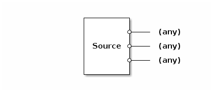
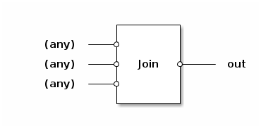
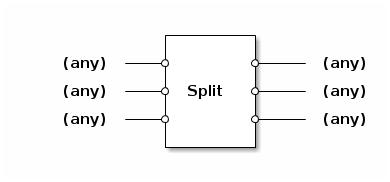
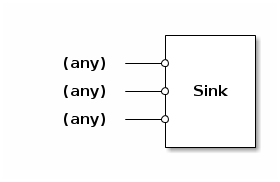

# Basic Apps (apps.basic.basic_apps)

The module *apps.basic.basic_apps* provides apps with general
functionality for use in you app networks.

## Source

The `Source` app is a synthetic packet generator. On each breath it
outputs 1,000 new packets to each attached output port. The packet
data is uninitialized garbage and each packet is 60 bytes long.

## Join

The `Join` app joins together packets from N input links onto one
output link. On each breath it outputs as many packets as possible
from the inputs onto the output.

## Split

The `Split` app splits packets from multiple inputs across multiple
outputs. On each breath it transfers as many packets as possible from
the input links to the output links.

## Sink

The `Sink` app receives all packets from any number of input links and
discards them. This can be handy in combination with a `Source`.

## Buzz

The `Buzz` app simply prints a message to standard output each time a
callback runs. This can be useful for observing the execution of the app
framework in a primitive way.

