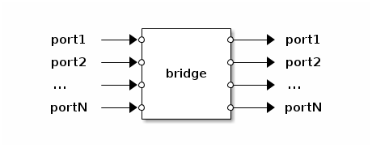

# Bridge Apps

A `bridge` app implements a basic Ethernet bridge with split-horizon
semantics. It has an arbitrary number of ports. For each input port there
must exist an output port with the same name. Each port name is a member
of at most one *split-horizon group*. If it is not a member of a
split-horizon group, the port is also called a *free port*. Packets
arriving on a free input port may be forwarded to all other output
ports. Packets arriving on an input port that belongs to a split-horizon
group are never forwarded to any output port belonging to the same
split-horizon group. There are two `bridge` implementations available:
`apps.bridge.flooding` and apps.bridge.learning`.

## Configuration

A `bridge` app accepts a table as its configuration argument. The
following keys are defined:

— Key **ports**

*Optional*. An array of free port names. The default is no free ports.

— Key **split_horizon_groups**

*Optional*. A table mapping split-horizon groups to arrays of port
names. The default is no split-horizon groups.

— Key **config**

*Optional*. The configuration of the actual bridge implementation.

# Flooding bridge (apps.bridge.flooding)

The flooding `bridge` app implements the simplest possible bridge, which
floods a packet arriving on an input port to all output ports within its
scope according to the split-horizon topology.

## Configuration

The flooding `bridge` app ignores the *config* key of its configuration.

# Learning bridge (apps.bridge.learning)

The learning `bridge` app implements a *learning bridge* using a [Bloom
filter](https://en.wikipedia.org/wiki/Bloom_filter) to store the set of
MAC source addresses of packets arriving on each input port. When a
packet is received it is forwarded to all output ports whose
corresponding input ports match the packet's destination MAC address.
When no input port matches, the packet is flooded to all output ports.
Multicast MAC addresses are always flooded to all output ports associated
with the input port. The scoping rules according to the split-horizon
topology apply unchanged.

## Configuration

The learning `bridge` app accepts a table as the value of the *config*
key of its configuration. The following keys are defined:

— Key **mac_table_size**

**Optional**. Expected maximum number of MAC addresses to store in each
per-port Bloom filter. Default is 1000.

— Key **fp_rate**

**Optional**. Maximum rate of false-positives for look-ups in the Bloom
filters, provided the number of distinct objects stored in the filter
does not exceed *mac_table_size*. Default is 0.001.

— Key **timeout**

**Optional**. Timeout for learned MAC addresses in seconds. Default is
60.

— Key **verbose**

**Optional**. A boolean value. If true, enables the printing of debugging
output. Default is `false`.
