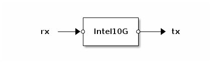
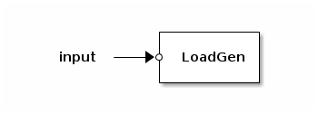

# Intel 82599 Ethernet Controller Apps

## Intel10G (apps.intel.intel_app)

The `Intel10G` drives one port of an Intel 82599 Ethernet controller.
Packets taken from the `rx` port are transmitted onto the network.
Packets received from the network are put on the `tx` port.

— Method **Intel10G.dev:get_rxstats**

Returns a table with the following keys:

* `counter_id` - Counter id
* `packets` - Number of packets received
* `dropped` - Number of packets dropped
* `bytes` - Total bytes received

— Method **Intel10G.dev:get_txstats**

Returns a table with the following keys:

* `counter_id` - Counter id
* `packets` - Number of packets sent
* `bytes` - Total bytes sent

### Configuration

The `Intel10G` app accepts a table as its configuration argument. The
following keys are defined:

— Key **pciaddr**

*Required*. The PCI address of the NIC as a string.

— Key **macaddr**

*Optional*. The MAC address to use as a string. The default is a
wild-card (e.g. accept all packets).

— Key **vlan**

*Optional*. A twelve bit integer (0-4095). If set, incoming packets from
other VLANs are dropped and outgoing packets are tagged with a VLAN
header.

— Key **vmdq**

*Optional*. Boolean, defaults to false. Enables interface
virtualization. Allows to have multiple `Intel10G` apps per port. If
enabled, *macaddr* must be specified.

— Key **mirror**

*Optional*. A table. If set, this app will receive copies of all selected
packets on the physical port. The selection is configured by setting keys
of the *mirror* table. Either *mirror.pool* or *mirror.port* may be set.

If *mirror.pool* is `true` all pools defined on this physical port are
mirrored. If *mirror.pool* is an array of pool numbers then the specified
pools are mirrored.

If *mirror.port* is one of "in", "out" or "inout" all incoming and/or
outgoing packets on the port are mirrored respectively.  Note that this
does not include internal traffic which does not enter or exit through
the physical port.

— Key **rxcounter**

— Key **txcounter**

*Optional*. Four bit integers (0-15). If set, incoming/outgoing packets
will be counted in the selected statistics counter respectively. Multiple
apps can share a counter. To retrieve counter statistics use
`Intel10G.dev:get_rxstats()` and `Intel10G.dev:get_txstats()`.

— Key **rate_limit**

*Optional*. Number. Limits the maximum Mbit/s to transmit. Default is 0
which means no limit. Only applies to outgoing traffic.

— Key **priority**

*Optional*. Floating point number. Weight for the *round-robin* algorithm
used to arbitrate transmission when *rate_limit* is not set or adds up to
more than the line rate of the physical port. Default is 1.0 (scaled to
the geometric middle of the scale which goes from 1/128 to 128). The
absolute value is not relevant, instead only the ratio between competing
apps controls their respective bandwidths. Only applies to outgoing
traffic.

For example, if two apps without *rate_limit* set have the same
*priority*, both get the same output bandwidth.  If the priorities are
3.0/1.0, the output bandwidth is split 75%/25%.  Likewise, 1.0/0.333 or
1.5/0.5 yield the same result.

Note that even a low-priority app can use the whole line rate unless other
(higher priority) apps are using up the available bandwidth.

### Performance

The `Intel10G` app can transmit and receive at approximately 10 Mpps per
processor core.

### Hardware limits

Each physical Intel 82599 port supports the use of up to:

* 64 *pools* (virtualized `Intel10G` app instances)
* 127 MAC addresses (see the `macaddr` configuration option)
* 64 VLANs (see the `vlan` configuration option)
* 4 *mirror pools* (see the `mirror` configuration option)

## Intel1G (apps.intel.intel1g.intel1g)

The `intel1g` app drives one port of an Intel Gigabit Ethernet
controller.

Hardware support:
- Intel I350 (in progress)

Features:
- Optionally attach to a pre-initialized NIC.
- Optionally use specific TX and RX queue numbers (or none).
- Configuration and statistics registers are mirrored to shared memory objects (NYI).
- Receive and transmit links are optional and can have any name.

### Configuration

— Key **pciaddr**

*Required*. The PCI address of the NIC as a string.

— Key **attach**

*Optional*. True means attach to a transmit and/or receive queue of an already-initialized NIC.

— Key **txq**

*Optional*. Transmit queue number to use. `false` means no transmit function. Default: 0.

— Key **rxq**

*Optional*. Receive queue number to use. `false` means no receive function. Default: 0.

— Key **ndesc**

*Optional*. Number of DMA descriptors to use i.e. size of the DMA
transmit and receive queues. Default is not specified but assumed to
be broadly applicable.

— Key **rxburst**

*Optional*. Maximum number of packets to receive on one
breath. Default is not specified but assumed to be broadly applicable.

## LoadGen (apps.intel.loadgen)

`LoadGen` is a *load generator* app based on the Intel 82599 Ethernet
controller. It reads up to 32,000 packets from the `input` port and
transmits them repeatedly onto the network. All incoming packets are
dropped.

### Configuration

The `LoadGen` app accepts a string as its configuration argument. The
given string denotes the PCI address of the NIC to use.

### Performance

The `LoadGen` app can transmit at line-rate (14 Mpps) without significant
CPU usage.
