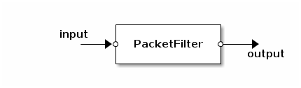

# Packet Filter App

## `PacketFilter` app: filter packets by its content

`PacketFilter` receives packets on the `input` port and transmits
conformant packets to the `output` port.

Constructor of `PacketFilter` is configured by string, which must represent
a valid Lua table constructor, actually list of rules.

Rule may contains next fields:
- `ethertype`, may be `ipv4` or `ipv6`, mandatory
- `protocol`, may be `icmp`, `udp` or `tcp`, optional
- `source_cidr`, should be IP range in CIDR notation, optional
- `dest_cidr`, should be IP range in CIDR notation, optional
- `source_port_min`, `source_port_max`, optional
- `dest_port_min`, `dest_port_max`, optional

Example:

    local c = config.new()
    local rules = [[
    {
       ethertype = "ipv4",
       protocol = "tcp",
       source_cidr = "145.240.0.0/12",
       source_port_min = 80,
       source_port_max = 80
    },
    {
       ethertype = "ipv6",
       protocol = "udp",
       dest_cidr = "3ffe:501:4819::/64",
       source_port_min = 2397,
       source_port_max = 2399,
       dest_port_min = 53,
       dest_port_max = 53
    }
    ]]
    config.app(c, "packet_filter", PacketFilter, rules)

`PacketFilter` generates code of its conform() method on the fly during
construction.
