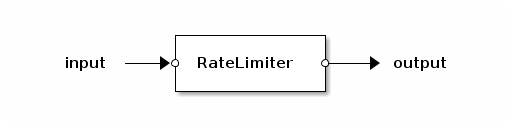

# Rate Limiter App

## `RateLimiter` app: enforce a bytes per second limit

The `RateLimiter` implements [Token bucket](http://en.wikipedia.org/wiki/Token_bucket "Token bucket")
algorithm with single bucket, dropping non-conformant packetes.
It recieves packets on the `input` port and transmit conformant packets
to the `output` port.

Bucket size should be big enough to process packets received
during 100 ms (the `RateLimiter` uses 100 ms timer internally).
Otherwise it may limit effective rate.

### Usage

Use following pattern to create and init Rate Limiter instance:

    app.apps.rate_limiter = app.new(RateLimiter.new(rate, bucket_size))
    app.apps.rate_limiter:init_timer()

The `rate_limiter:snapshot()` method returns statistics snapshot,
a table with next fields:
- `rx` - number of packets received
- `tx` - number of packets transmitted
- `time` - current time, ns

Having two snapshots it is easy to calculate app statistics.

See selftest for complete example.

### Performance

The `Rate limiter` is able to process more then 20 Mpps / core
using simple Source -> RateLimiter -> Sink pipeline.

Run selftest to see the numbers:

    sudo src/snabbswitch -t apps.rate_limiter.rate_limiter
