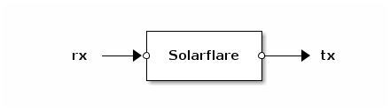

# Solarflare Ethernet Controller Apps

## Solarflare (apps.solarflare.solarflare)

The `Solarflare` app drives one port of a Solarflare SFN7 Ethernet
controller. Multiple instances of the Solarflare app can be instantiated
on the same PCI device. Packets received from the network will be
dispatched between apps based on destination MAC address and VLAN.
Packets taken from the `rx` port are transmitted onto the network.
Packets received from the network are put on the `tx` port.

The `Solarflare` app requires [OpenOnload](http://www.openonload.org/)
version *201502* to be installed and the `sfc` module to be loaded.

### Configuration

The `Solarflare` app accepts a table as its configuration argument. The
following keys are defined:

— Key **pciaddr**

*Required*. The PCI address of the NIC as a string.

— Key **macaddr**

*Optional*. The MAC address to use as a string. The default is a
wild-card (e.g. accept all packets).

— Key **vlan**

*Optional*. A twelve bit integer (0-4095). If set, incoming packets from
other VLANs are dropped and outgoing packets are tagged with a VLAN
header.
