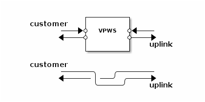

# VPWS App (apps.vpn.vpws)

The `VPWS` app implements a so-called Virtual Private Wire Service
(VPWS). It provides a L2 VPN on top of IP (v4/v6) and GRE.

This app has two duplex ports, `customer` and `uplink`.  The former
transports Ethernet frames while the latter transports Ethernet frames
encapsulated in IP/GRE. Packets transmitted on the `customer` input port
are encapsulated and put on the `uplink` output port. Packets transmitted
on the `uplink` input port are decapsulated and put on the `customer`
output port.

## Configuration

The `vpws` app accepts a table as its configuration argument. The
following keys are defined:

— Key **local_vpn_ip**

*Required*. Local VPN IPv6 address as a string or in binary
representation.

— Key **remote_vpn_ip**

*Required*. Remote VPN IPv6 address as a string or in binary
representation.

— Key **local_mac**

*Required*. Local MAC address as a string or in binary representation.

— Key **remote_mac**

*Optional*. Remote MAC address as a string or in binary
representation. Default is `02:00:00:00:00:00`.

If *remote_mac* is not supplied, the `uplink` port needs to be connected
to something that performs address resolution and overwrites the Ethernet
header (e.g. the `nd_light` app).

— Key **checksum**

*Optional*. Enables GRE checksumming if set to a true value.

— Key **label**

*Optional*. A GRE key (32 bit unsigned integer). Enables GRE keying if
supplied.
