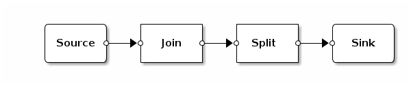

## Basic appliance: Test basic apps with synthetic traffic.

### Configuration

None.

### App Networks

This is not the most exciting topology to imagine e.g. with Join and
Split having only one input and one output.

### Performance

    Hardware  | commit   | Mpps
    ----------+----------+------
    chur      | 6a3c2651 | 39
    chur      | 5839dd69 | 34

