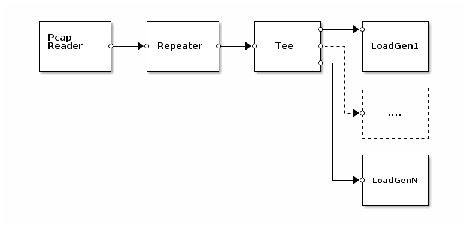

## `loadgen`: Load-generator design

The loadgen design reads a PCAP trace file, creates a loop from its
contents (in case of short traces), and simultaneously loads this
traffic into a set of LoadGen apps. The result is that each LoadGen
app transmits the contents of the pcap input file in a loop.

### Usage

    snabbswitch [opts...] designs.loadgen.loadgen <pcapfile> [port...]

    Generates load by replaying <pcapfile> onto each matched ethernet port.

    If no port arguments are given then every available port is used.
    Otherwise each port is a Lua pattern to match with the PCI address
    of an Intel 82599-based ethernet controller.

    Examples (from chur.snabb.co test server):

      # Use all NICs
      snabbswitch designs.loadgen.loadgen foo.pcap

      # Use two NICs, one from each NUMA node
      snabbswitch designs.loadgen.loadgen foo.pcap 0000:01:00.1 0000:82:00.1
      # (shorter version)
      snabbswitch designs.loadgen.loadgen foo.pcap 01:00.1 82:00.1

      # Use all NICs on NUMA node 0
      snabbswitch designs.loadgen.loadgen foo.pcap 0000:0
      # Use all NICs on NUMA node 1
      snabbswitch designs.loadgen.loadgen foo.pcap 0000:8

### Performance

    Hardware  | commit   | # ports | pktlen | NUMA  | Mpps   | Mpps / port
    ----------+----------+---------+--------+-------+--------+------------
    chur      | 46605d54 | 20      |     64 | Good  | 266    | 13.3
    chur      | 46605d54 | 20      |     64 | Bad   | 204    | 10.2
    chur      | 46605d54 | 1       |     64 | Good  |  14.1  | 14.2
    chur      | 46605d54 | 1       |     64 | Bad   |  13.9  | 13.9

NUMA Note: Each PCIe NIC is attached to one physical CPU. NUMA is
"Good" when DMA for every NIC is accessing the RAM of the CPU that it
is attached to. Otherwise, it's "Bad".
