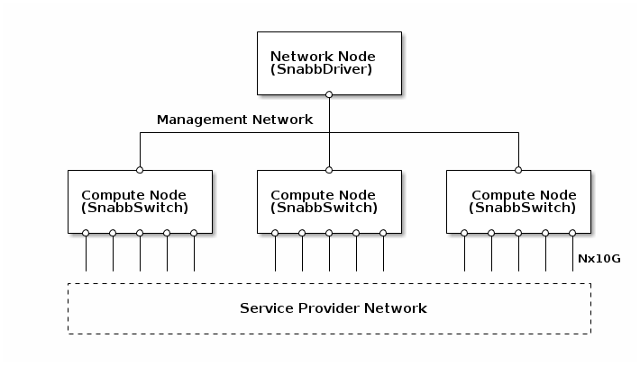
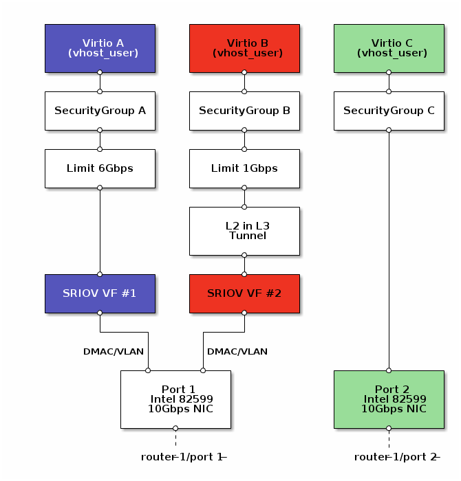

# Snabb NFV

*This document describes work-in-progress.*

Snabb NFV is an open source [Network Functions
Virtualization](http://en.wikipedia.org/wiki/Network_Functions_Virtualization)
system for OpenStack Neutron.

Design goals:

* Robust: No bottleneck and no single point of failure.
* High capacity: 40+ Gbps Ethernet bandwidth per compute host.
* Transparent: Connect to the operator's own "provider" network.

The software is designed to be suitable for large Service Provider
networks such as Deutsche Telekom's innovative
[TeraStream](https://ripe67.ripe.net/archives/video/3/).

## System Requirements

* OpenStack Havana.
* KVM hypervisor.
* Intel 82599 Ethernet controller on compute nodes.

## OpenStack architecture

Snabb NFV for OpenStack consists of two pieces of software:

* Snabb Mechanism Driver: Extension to the OpenStack Neutron ML2 plugin.
* Snabb Switch: Software switch on compute hosts. 

Configuration and management is performed via OpenStack Neutron using
a subset of the standard Neutron API.

The initial supported Neutron features are:

* Provider networks (mapped 1:1 onto SR-IOV Virtual Functions).
* Security Groups and bandwidth policing (firewall & anti-abuse).
* Ethernet-over-IPv6 tunneling for selected VM ports.

Further network services have to be implemented by the operator
network and its service VMs, e.g. DHCP, NAT, overlays, and routing.

## Snabb Switch on Compute node

Snabb Switch provides a data plane based on a hybrid between software
and SR-IOV. Software provides a Virtio-net abstraction, Security Group
packet filtering, bandwidth policing, and Ethernet-over-IP tunneling.
SR-IOV hardware provides zero-copy DMA acceleration.

## Example setup

Here is a detailed example configuration with one compute node serving
three service VMs over two 10G ethernet ports:

* Virtio A is filtered, bandwidth limited, and VLAN tagged, and connected to SR-IOV.
* Virtio B is filtered, bandwidth limited, and tunneled over Layer-3, VLAN tagged, and connected to SR-IOV.
* Virtio C is filtered and connected to a complete 10G network interface.

### Neutron configuration

    # Create security groups and rules
    neutron secgroup-create SecGroupA && neutron secgroup-add-rule SecGroupA ...
    neutron secgroup-create SecGroupB && neutron secgroup-add-rule SecGroupB ...
    neutron secgroup-create SecGroupC && neutron secgroup-add-rule SecGroupC ...

    # Create QoS policies
    neutron qos-create QosA type=ratelimit policy=6Gbps
    neutron qos-create QosB type=ratelimit policy=1Gbps

    # Create tunnel encapsulations.
    neutron tunnel-create TunnelB type=L2TPv3 tunnel_id=3000 peer_tunnel_id=4000 encap=udp local=2001:DB8::1 remote=2001:DB8::2

    # Create networks.
    neutron net-create NetworkA --provider:network_type=snabb --provider:physical_network=Router1/Port1/VF1 --provider:segmentation_id=42
    neutron net-create NetworkB --provider:network_type=snabb --provider:physical_network=Router1/Port1/VF2 --provider:segmentation_id=42 --tunnel=TunnelB
    neutron net-create NetworkC --provider:network_type=snabb --provider:physical_network=Router1/Port2

    # Create ports.
    neutron port-create VirtioA --network=NetworkA binding:vif_type=snabb --qos=QosA
    neutron port-create VirtioB --network=NetworkB binding:vif_type=snabb --qos=QosB
    neutron port-create VirtioC --network=NetworkC binding:vif_type=snabb

#### Snabb Switch configuration

This Snabb Switch configuration is generated by the Snabb Mechanism
Driver in Neutron:

    apps.VirtioA = VhostUser:new("/var/snabb/vhost/VirtioA.socket")
    apps.VirtioB = VhostUser:new("/var/snabb/vhost/VirtioB.socket")
    apps.VirtioC = VhostUser:new("/var/snabb/vhost/VirtioC.socket")

    apps.SecGroupA = SecGroup:new({rule=...})
    apps.SecGroupB = SecGroup:new({rule=...})
    apps.SecGroupC = SecGroup:new({rule=...})

    apps.LimitA = Limit:new({gbps=6})
    apps.LimitB = Limit:new({gbps=1})

    apps.Port1 = intel10g:new({pciaddr=...})
    apps.Port1VF1 = multiqueue:new(..., color=apps.VirtioA.get_color())
    apps.Port1VF2 = multiqueue:new(..., color=apps.VirtioB.get_color())
    apps.Port2 = intel10g:new({pciaddr=..., color=Apps.VirtioC.get_color()})

    apps.TunnelC = L2TPv3:new({...})

    -- Create links between apps
    app.connect(apps.VirtioA, "tx",    apps.SecGroupA, "vm")
    ...

#### Snabb Switch operation

This diagram shows the operational state of Snabb Switch's "app
network" after the configuration has been loaded.

Colors show DMA affinity between hardware and software network ports.
Packets that ingress and egress with the same color are zero-copy.

