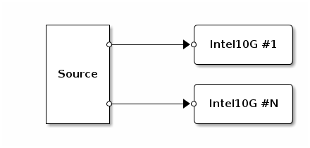

## Spammer: Blast packets out of many ports

The Spammer appliance discovers all available network ports and
continuously blasts synthetic packets out of them.

### Configuration

* `packet_size` = 60..1500 [60]

Note: The appliance automatically uses every Intel10G NIC that is not
already in use by the operating system.

### App network

	     
This network is dynamically constructed with an App for each available port.

### Performance

    Hardware  | commit   | # ports | pktlen | Mpps   | Mpps / port
    ----------+----------+---------+--------+--------+------------
    chur      | ee7e40ec | 1       | 64     | 12.8   | 12.8
    chur      | ee7e40ec | 2       | 64     | 12.8   |  6.4
    chur      | ee7e40ec | 4       | 64     | 10.0   |  2.5
    chur      | ee7e40ec | 8       | 64     |  8.4   |  1.05
    chur      | ee7e40ec | 16      | 64     |  7.2   |  0.45
    chur      | ee7e40ec | 20      | 64     |  6.6   |  0.33

(This table should be easy to auto-generate e.g. via buildbot on
multiple hosts. This one is real but I did the testing by hand.)

