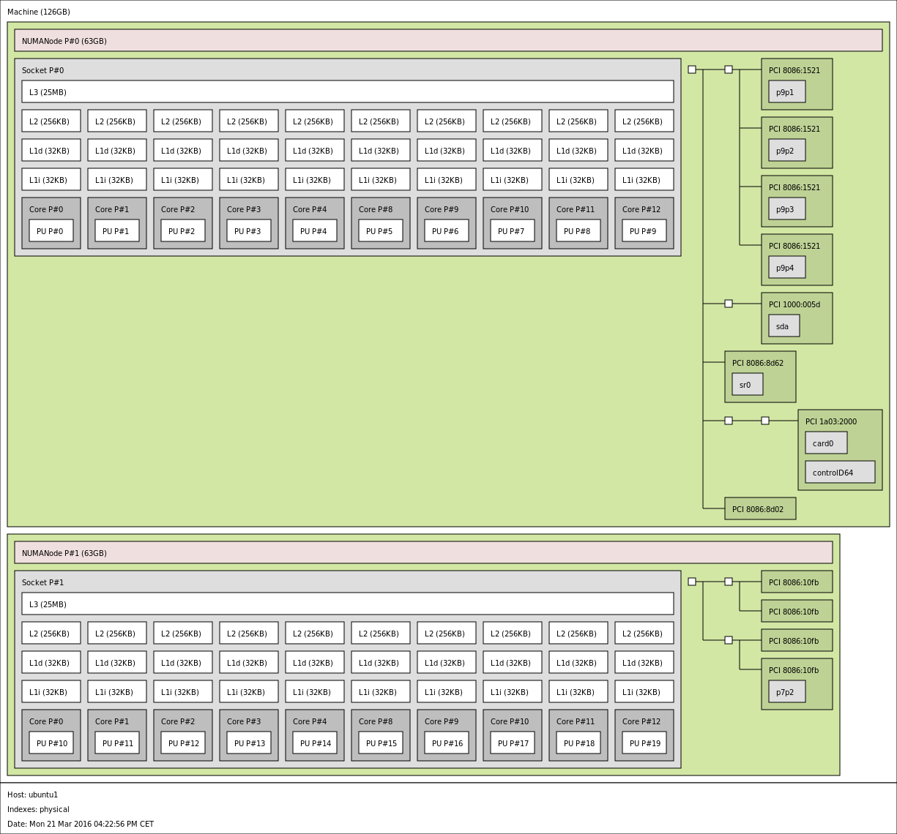

# Maximizing deployment performance

For maximum performance, several hardware, operating system and Snabb
parameters need to be tuned.  We start with some generic
system-oriented tips and move towards application configuration.

## BIOS settings

### Prioritize performance over energy efficiency

Go into your BIOS and verify that you or your hardware vendor have not
enabled aggressive power-saving modes that could downclock your
processors.  A CPU in a power-saving mode typically takes some time to
return to peak performance, and this latency can cause packet loss.
Servers are often shipped configured to prioritize energy efficiency
over performance, which is not the best choice if avoiding packet loss
is a goal.

Note that each vendor offers different BIOS settings to enable or
disable energy efficiency settings or profiles, typically named "Max
performance", "Energy Efficiency" and "Custom".  Select "Max
performance" for latency sensitive Snabb use.

### Disable hyperthreads

Hyperthreads are a way of maximizing resource utilization on a CPU core,
driven by the observation that a CPU is often waiting on memory or some
external event, and might as well be doing something else while it's
waiting.  In such a situation, it can be advantageous to run a second
thread on that CPU.

However for Snabb that's exactly what we don't want.  We do not want
another thread competing for compute and cache resources on our CPU
and increasing our latency.  For best results, lowest latency, and to
avoid a source of packet loss, disable hyperthreading via the BIOS
settings.

### Consider disabling Turbo Boost

Intel Turbo Boost Technology allows processor cores to run faster than
the rated operating frequency if they're operating below power,
current, and temperature specification limits.  The conservative thing
to do is to turn off Turbo Boost when doing performance tests of Snabb
data planes, because that way you reduce variance due to CPU clock
speed changing.

## System settings

### Adjust CPU frequency governor

To avoid power-saving heuristics causing decreased throughput and higher
latency, set the CPU frequency governor to `performance`:

```bash
for CPUFREQ in /sys/devices/system/cpu/cpu*/cpufreq/scaling_governor; do
   [ -f $CPUFREQ ] || continue;
   echo -n performance > $CPUFREQ;
done
```

### Reserve CPUs for data plane usage

When running a Snabb data plane, we don't want interference from the
Linux kernel.  In normal operation, a Snabb data plane won't even make
any system calls at all.  You can prevent the Linux kernel from
pre-empting your Snabb application to schedule other processes on its
CPU by reserving CPUs via the `isolcpus` kernel boot setting.

To isolate CPUs, boot your Linux kernel with the `isolcpus` parameter.
Under NixOS, edit `/etc/nixos/configuration.nix` to add this parameter:

```
boot.kernelParams = [ "isolcpus=1-5,7-11" ];
```

The line above prevents the kernel to schedule processes in CPUs ranging
from 1 to 5 and 7 to 11. That leaves CPUs 0 and 6 for the Linux kernel.
By default, the kernel will arrange deliver interrupts to the first CPU
on a socket, so this `isolcpus` setting should also isolate the
data plane from interrupt handling as well.

After adding the `isolcpus` flag run `nixos-rebuild switch` and then reboot 
your workstation to enable the changes.

For a standard Ubuntu or other system, edit `/etc/default/grub` to add the appropriate `isolcpus` line.

```
GRUB_CMDLINE_LINUX_DEFAULT="... isolcpus=1-5,7-11 ..."
```

### Avoid interrupts on data-plane CPUs

Normally Linux will handle hardware interrupts on the first core on a
socket.  In our case above, that would be cores 0 and 6.  That works
well with our `isolcpus` setting as well: interrupts like timers and so
on will only get delivered to the cores which Linux is managing already,
and won't interrupt the data planes.

However, some distributions (notably Ubuntu) enable `irqbalanced`, a
daemon whose job it is to configure the system to deliver interrupts
to all cores.  This can increase interrupt-handling throughput, but
that's not what we want in a Snabb scenario: we want low latency for
the data plane, and handling interrupts on data-plane CPUs is
undesirable.  When deploying on Ubuntu, be sure to disable
`irqbalanced` by setting `ENABLED` to 0 in `/etc/default/irqbalance`:

```
$ cat /etc/default/irqbalance
#Configuration for the irqbalance daemon

#Should irqbalance be enabled?
ENABLED="0"
...
```

Various interrupt counters per CPU core can be retrieved via 

```
$ cat /proc/interrupts
            CPU0       CPU1       CPU2       CPU3       CPU4       CPU5       CPU6       CPU7       CPU8       CPU9       CPU10      CPU11      CPU12      CPU13      CPU14      CPU15      CPU16      CPU17      CPU18      CPU19
   0:         41          0          0          0          0          0          0          0          0          0          0          0          0          0          0          0          0          0          0          0  IR-IO-APIC    2-edge      timer
   8:          1          0          0          0          0          0          0          0          0          0          0          0          0          0          0          0          0          0          0          0  IR-IO-APIC    8-edge      rtc0
...
```

### Disable IOMMU

The oldest CPU supported by Snabb is the Sandy Bridge series, and this
series happens to have a bug in their IOMMU support that can manifest
itself either as total packet loss or severe performance penalties.
As a result of this bug, we never test Snabb data planes with the
IOMMU on even on later CPU models, so in production you should also
disable the IOMMU via a kernel boot parameter:

```
# Ubuntu
GRUB_CMDLINE_LINUX_DEFAULT="... intel_iommu=off ... "

# NixOS
boot.kernelParams = [ ... "intel_iommu=off" ... ];
```

It is said that newer CPUs don't have this issue and that we should be
using `iommu=pt` for "passthrough" support.  See
http://dpdk.org/ml/archives/dev/2014-October/007411.html and
https://lwn.net/Articles/329174/ for further details.  The IOMMU
sounds like a nice idea and we would like to be able to take advantage
of it eventually.

### Provision huge pages

By default on a Xeon machine, the virtual memory system manages its
allocations in 4096-byte "pages".  It has a "page table" which maps
virtual page addresses to physical memory addresses.  Frequently-used
parts of a page table are cached in the "translation lookaside buffer"
(TLB) for fast access.  A virtual memory mapping that describes 500 MB
of virtual memory would normally require 120000 entries for 4096-byte
pages.  However, a TLB only has a limited amount of space and can't hold
all those entries.  If it is missing an entry, that causes a "TLB miss",
causing an additional trip out to memory to fetch the page table entry,
slowing down memory access.

To mitigate this problem, it's possible for a Xeon machine to have some
"huge pages", which can be either 2 megabytes or 1 gigabyte in size.
The same 500MB address space would then require only 250 entries for 2MB
hugepages, or just 1 for 1GB hugepages.  That's a big win!  Also,
memory within a huge page is physically contiguous, which is required to
interact with some hardware devices, notably the Intel 82599 NICs.

However because hugepages are bigger and need to be physically
contiguous, it may be necessary to pre-allocate them at boot-time.  To
do that, add the `default_hugepagesz`, `hugepagesz`, and `hugepages`
parameters to your kernel boot.  In NixOS, we use the following, adding
on to the `isolcpus` setting mentioned above:

```
boot.kernelParams = [ "default_hugepagesz=2048K" "hugepagesz=2048K"
                      "hugepages=10000" "isolcpus=1-5,7-11" ];
```

For Ubuntu, edit the Grub configuration as described above.

To use one-gigabyte huge pages, replace `2048K` above with `1G` and
reduce the `hugepages` count down to something more reasonable,
perhaps 64.

Actual use of hugepages can be monitored with 

```
$ cat /proc/meminfo |grep Huge
AnonHugePages:  12310528 kB
HugePages_Total:      64
HugePages_Free:       58
HugePages_Rsvd:        0
HugePages_Surp:        0
Hugepagesize:    1048576 kB
```

On NUMA systems, the allocation and usage per node can be seen with
 
```
$ cat /sys/devices/system/node/node*/meminfo|grep Huge
Node 0 AnonHugePages:     12288 kB
Node 0 HugePages_Total:    32
Node 0 HugePages_Free:     32
Node 0 HugePages_Surp:      0
Node 1 AnonHugePages:  12298240 kB
Node 1 HugePages_Total:    32
Node 1 HugePages_Free:     26
Node 1 HugePages_Surp:      0
```

(The above example shows six 1G pages in use on Node 1 with 2 Snabb
processes serving one 10GE port each).

## Running the data plane

### Set CPU affinity

Many Snabb network functions take a `--cpu` argument, which will
arrange for the Snabb process to run on a particular CPU.  It will
also arrange to make sure that all memory used by that Snabb process
is on the same NUMA node as that CPU, and it will check that any PCI
device used by that Snabb process has affinity to that NUMA node, and
issue a warning if anything is amiss.

If the Snabb network function that you are using does not have a
`--cpu` option, file a bug.  Binding Snabb to a CPU and NUMA node can
also be done using the `numactl --membind` and `taskset -c` commands,
but we recommend the `--cpu` argument as it is easiest and it also
runs various consistency checks, such as checking that PCI devices
that you use are local to your NUMA node.

### Use PCI devices and memory that is NUMA-local to your CPU

In a machine with multiple sockets, you usually have Non-Uniform
Memory Access, or NUMA.  On such a system, a PCI device or a range of
memory might be "closer" to one node than another.  The `--cpu`
argument to a nework function, described above, will issue a warning
if you use a PCI device that is not local to the NUMA node that
corresponds to the chosen CPU.

To determine what PCI devices are local to what NUMA nodes, you need to
grovel around in `/sys`.  For example if you are going to be working
with NICs `0000:01:00.0`, `0000:01:00.1`, `0000:02:00.0`, and
`0000:02:00.1`, check:

```bash
$ for device in 0000:0{1,2}:00.{0,1}; do \
    echo $device; cat /sys/bus/pci/devices/$device/numa_node; \
  done
0000:01:00.0
0
0000:01:00.1
0
0000:02:00.0
0
0000:02:00.1
0
```

So all of these are on NUMA node 0.  Then you can check your CPUs:

```
$ numactl -H | grep cpus
node 0 cpus: 0 1 2 3 4 5
node 1 cpus: 6 7 8 9 10 11
```

So for these we should run our binaries under `--cpu CPU` to bind them
to CPUs in the NUMA node 0, and to arrange to use only memory that is
local to that CPU.

Note that Linux also offers the command `lstopo` to get an overall
picture in text and graphical form:

```
lstopo --of pdf > lstopo.pdf
```

Example from a Lenovo RD650 (Intel(R) Xeon(R) CPU E5-2650 v3):


### Tweak ring buffer sizes

The way that Snabb interfaces with a NIC is that it will configure the
NIC to receive incoming packets into a /ring buffer/.  This ring buffer
is allocated by Snabb (incidentally, to a huge page; see above) and will
be filled by the NIC.  It has to be a power of 2 in size: so it can hold
space for 64 packets, 128 packets, 256 packets, and so on.  The default
size is 1024 packets and the maximum is 65536.  The NIC will fill this
buffer with packets as it receives them: first to slot 0, then to slot
1, all the way up to slot 511 (for a ring buffer of the default size),
then back to slot 0, then slot 1, and so on.  Snabb will periodically
take some packets out of this read buffer (currently 128 at a time),
process them, then come back and take some more: wash, rinse, repeat.

Many network functions offer the ability to configure the ring buffer
size via a `--ring-buffer-size` argument.  (Again, if the network
function you are using does not provide this option, file a bug.)
What is the right size?  Well, there are a few trade-offs.  If the
buffer is too big, it will take up a lot of memory and start to have
too much of a cache footprint.  The ring buffer is mapped into Snabb's
memory as well, and the NIC arranges for the ring buffer elements that
it writes to be directly placed in L3 cache.  This means that
receiving packets can evict other entries in L3 cache.  If your ring
buffer is too big, it can evict other data resident in cache that you
might want.

Another down-side of having a big buffer is latency.  The bigger your
buffer, the more the bloat.  Usually, Snabb applications always run
faster than the incoming packets, so the buffer size isn't an issue when
everything is going well; but in a traffic spike where packets come in
faster than Snabb can process them, the buffer can remain full the whole
time, which just adds latency for the packets that Snabb does manage to
process.

However, too small a buffer exposes the user to a higher risk of
packet loss due to jitter in the Snabb breath time.  A "breath" is one
cycle of processing a batch of packets, and as we mentioned it is
currently up to 128 packets at a time.  This processing doesn't always
take the same amount of time: the contents of the packets can
obviously be different, causing different control flow and different
data flow.  Even well-tuned applications can exhibit jitter in their
breath times due to differences between what data is in cache (and
which cache) and what data has to be fetched from memory.  Infrequent
events like reconfiguration can also cause one breath to take longer
than another.  Poorly-tuned applications might have other sources of
latency such as garbage collection, though this is not usually the
case in production-ready Snabb network functions like the NFV virtual
switch or the lwAFTR.

So, a bigger ring buffer insulates packet processing from breath
jitter.  You want your ring buffer to be big enough to not drop
packets due to jitter during normal operation, but not bigger than
that.  In our testing we usually use the default ring buffer size.  In
your operations you might want to increase this up to 2048 entries.
We have not found that bigger ring buffer sizes are beneficial, but it
depends very much on the environment.

Remember that buffers are fundamentally mechanisms for smoothing over
variations in latency.  The real problem is the latency variation --
focus your effort on getting that right and you won't have to fiddle
much with ring buffer sizes.

## Virtualization

Running network functions under a Snabb NFV virtual switch is a great
for isolation, however you do have to get a number of things right or
you are not going to have a good experience.  Really we should link
out to another guide here, but until that happens, here are some brief
notes.

### Host-side switches: Snabb NFV, Snabb vMX

All of the above considerations apply to running a virtual switch --
give each virtual switch instance a dedicated CPU core on the host,
bind it to the same NUMA node of the card and the CPU, and make sure
there are enough huge pages.

Additionally, for good performance, the host switch must run on the
same NUMA node as the guest.

### QEMU & Vhost-User

[Vhost-User](http://www.virtualopensystems.com/en/solutions/guides/snabbswitch-qemu/)
is used to connect Snabb with a high performance virtual interface
attached to a QEMU-based virtual machine.  This requires hugepages
made available to Qemu:

```
cd <qemu-dir>/bin/x86_64-softmmu/
qemu-system-x86_64 -enable-kvm -m 8000 -smp 2 \
    -chardev socket,id=char0,path=./xe0.socket,server \
    -netdev type=vhost-user,id=net0,chardev=char0 \
    -device virtio-net-pci,netdev=net0,mac=02:cf:69:15:0b:00   \
    -object memory-backend-file,id=mem,size=8000M,mem-path=/hugetlbfs,share=on \
    -numa node,memdev=mem -mem-prealloc \
    -realtime mlock=on  \
    /path/to/img
```

The allocated memory must match the memory-backend-file size (example
shows 8GB). While qemu will fail to boot if there isn't enough
hugepages allocated, it is recommended to have some spare and note
that the pages are split amongst the NUMA nodes. Check the paragraph
on NUMA in this document.  It is recommended to specify the qemu
option '-realtime mlock=on', despite it being the default. This
ensures memory doesn't get swapped out.

Virtual switches like Snabb NFV and Snabb vMX share memory also with
one or more QEMU processes running Virtual Machines via
VhostUser. These QEMU processes must also be pinned to the same NUMA
node with numactl with optional CPU pinning:

```
numactl --membind=1 /usr/local/bin/qemu-system-x86_64 ...
numactl --membind=1 --physcpubind=16-17 /usr/local/bin/qemu-system-x86_64 ...
```

Actual memory usage per node can be displayed with 'numastat':

```
$ sudo numastat -c snabb

Per-node process memory usage (in MBs)
PID              Node 0 Node 1 Total
---------------  ------ ------ -----
...
6049 (snabb)          0   3731  3731
6073 (snabb)          0   3732  3732
...
---------------  ------ ------ -----
Total                 5   7753  7758
$ sudo numastat -c qemu

Per-node process memory usage (in MBs)
PID              Node 0 Node 1 Total
---------------  ------ ------ -----
1899 (qemu-syste      0   7869  7869
1913 (qemu-syste      0   4171  4171
...
---------------  ------ ------ -----
Total                 4  12040 12044
```

Above example shows two snabb processes (6049 & 6073) using memory
only from node 1 as desired based on the NIC ports served by node
1. Two QEMU based Virtual Machines also only use memory from node 1.
If some memory is still used by another node for a given process,
investigate its source and fix it. Possible candidates are SHM based
filesystems use by Snabb in /var/run/snabb and SNMP SHM location if
enabled.

### Docker

CPU pinning via tasket and numactl work also within Docker Containers
running in privileged mode. It is important to note that the Container
can use all CPU cores, including the ones specifically excluded by the
kernel option isolcpus:

```
$ taskset -cp $$
pid 9822's current affinity list: 0,4-8,12-15

$ docker run --name ubuntu -ti ubuntu:14.04.4
root@c819e0f106c4:/# taskset -cp $$
pid 1's current affinity list: 0-15
```

## Application-specific performance notes

### lwAFTR

#### Avoid fragmentation

Fragment reassembly is a costly operation.  Make sure that network
MTUs are set such that fragmentation is rare.

#### Ingress and egress filtering

Simply enabling ingress and/or egress filtering has a cost.  Enabling
all filters adds 4 apps to the Snabb graph, and there is a cost for
every additional Snabb app.  In our tests, while a normal run can do
10 Gbps over two interfaces in full duplex, enabling filters drops
that to 8.2 Gbps before dropping packets.  However we have not found
that the performance depends much on the size of the filter, as the
filter's branches are well-biased.

## Programming notes

Here are a couple of notes for people writing their first Snabb data
plane.

### Enable engine.busywait

Defined in src/core/app.lua and enabled before calling engine.main()
via

```
engine.busywait = true
engine.main(...)
```

If true then the engine will poll for new data in a tight loop (100%
CPU) instead of sleeping according to the Hz setting. This will reduce
overall packet latency and increase throughput at the cost of
utilizing the CPU hosting Snabb at 100%.

### Monitor ingress drops

As we mentioned above, a Snabb data plane that is not running fast
enough will fail to handle all packets incoming from the network.  If
the network hardware supports it, Snabb can monitor these drops.
Install an "IngressDropMonitor" timer from
`lib.timers.ingress_drop_monitor`, to issue warnings when your app is
too slow.

### Watch for TLB shootdowns

TLB (Translation Lookaside Buffer) is a cache of the translations from
virtual memory addresses to physical memory addresses. When a
processor changes the virtual-to-physical mapping of an address, it
needs to tell the other processors to invalidate that mapping in their
caches.  The actions of one processor causing the TLBs to be flushed
on other processors is what is called a TLB shootdown.

Occasional packet loss at ingress has been observed while TLB
shootdowns happened on the system.  There are per-CPU counters of TLB
shootdowns available in the output of 'cat /proc/interrupts':

```
$ cat /proc/interrupts |grep TLB
 TLB:       2012       2141       1778       1942       2357       2076       2041       2129       2209       1960        486          0          0          0          0          0          0        145          0          0   TLB shootdowns
```

They should remain 0 for the CPU serving Snabb (pinned via taskset or
numactl).
