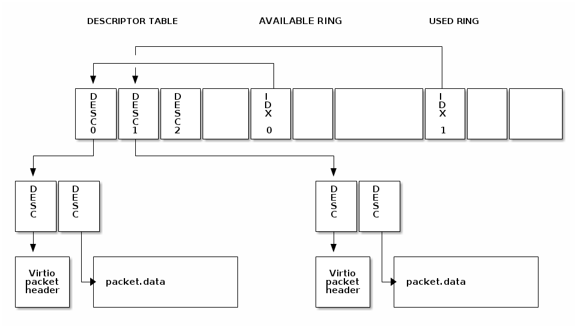

# Virtio support library (lib.virtio)

The `Virtio` library implements the virt-queue handling as described in
[virtio-net](http://docs.oasis-open.org/virtio/virtio/v1.0/csprd04/virtio-v1.0-csprd04.html)
specification. The device part is used in the VhostUse, while the driver part is used
in the VirtioNet app.

The Basic operation of the virtqueues is presented on the picture. The driver puts a packet in
a descriptor and then adds its index in the Available ring. The Device gets that packet processes
it and puts it back to the Used ring for recycling. The Tx virtqueue is used to send packets - i.e.
the available ring points to descriptors with real packets. The Rx virtqueue on the other hand offers
empty buffers (packets) to the device, so the packet is received in the descriptor pointed by the 
used ring indexes.

The virtio-net specification mandates that each packet is prepended with a packet header which contains
information such as checksum and segmentation offloading. The picture shows the usage of indirect 
descriptors, where the descriptor in the Descriptor table does not point to a real data buffer. Instead
they point to a table of chained descriptors which point to the real data.

During the initialization of the virtio-net driver, the following structures are created:
 * the descriptor table with all descriptors
 * the indirect descriptor tables
 * the virtio packet headers

After that sending a packet, or giving and empty buffer to the device is just a matter of finding the free
descriptor and attach a pointer to it.

