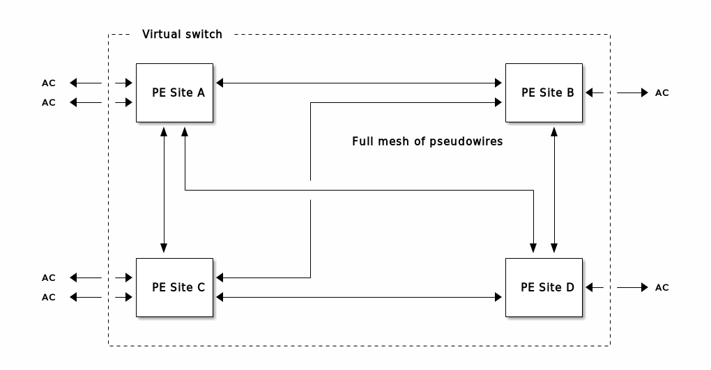
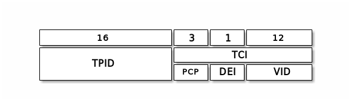
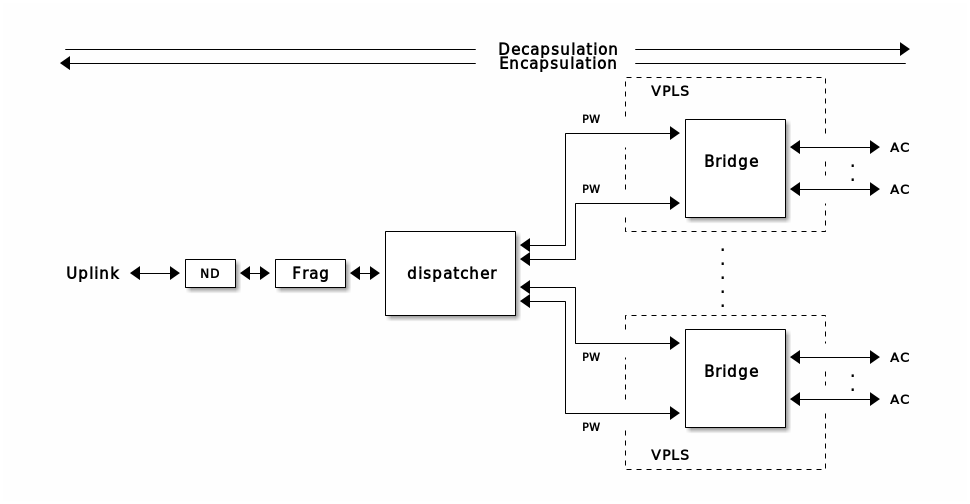
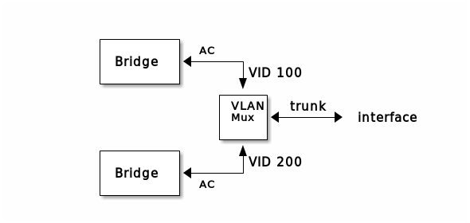

# Layer-2 VPN  (`program.l2vpn.l2vpn`)

## <a name="overview">Overview</a>

### General Architecture

The program `program.l2vpn.l2vpn` (sometimes abbreviated by `l2vpn` in
this document) implements a virtual multi-port Ethernet switch on top
of a plain IPv6 packet-switched network based on the architecture laid
out in RFC 4664.  From a customer perspective, the service consists of
a set of physical ports attached to the provider's network at
arbitrary locations with the semantics of a simple Ethernet switch,
a.k.a. _learning bridge_.  Each such port is called an _attachment
circuit_ (AC).

<a name="overview_MAC_learning"></a>Conceptually, the processing of an
Ethernet frame entering the virtual switch through any of the ACs
proceeds as follows.  First, the switch extracts the MAC source
address and adds it to the list of addresses reachable through the
ingress AC port.  This list is called the _MAC destination address
table_, or _MAC table_ for short.  Next, the switch extracts the MAC
destination address and forwards the frame according to the following
rules unless the address is a multicast address:

   * If the destination address is not found in any of the MAC tables,
     the frame is forwarded to all ACs except the one on which it was
     received

   * If the destination address is found in in one of the MAC tables,
     it is forwarded out of the corresponding port only

If the destination address is a multicast address, the frame is
forwarded to all egress ports except the one on which it was received.

Because the virtual switch is composed of distinct physical devices,
only the MAC tables of local ACs are directly accessible.  Therefore,
a mechanism is needed that provides discovery of the remote device to
which the destination is connected and a method to transfer the
Ethernet frame to that device.

The service is implemented by connecting the set of _provider edge_
devices (PE) that host the attachment circuits by tunnels which
transport the Ethernet frames within IPv6 packets using an appropriate
encapsulation mechanism called the _tunneling protocol_.  Each such
tunnel is called a _pseudowire_ (PW) and contains exactly two
endpoints.  Conceptually, each PE implements its own learning bridge
to which all local attachment circuits and pseudowires are connected.
The bridge maintains MAC tables for all of those ports.  In general,
the resulting topology contains loops and a mechanism is needed that
prevents packets from entering any such loop, such as the _spanning
tree protocol_ (SPT).  This implementation uses a full mesh of PWs
together with _split horizon_ forwarding to avoid loops without the
need for SPT.  In this model, each PE maintains a PW to every other PE
(this is the full mesh) with the rule that a frame received on any PW
is never forwarded to any other PW (this is the split-horizon rule).
The trade-off with respect to SPT is that the number of PWs in the
system scales quadratically with the number of PE devices.

The following figure illustrates the model with a setup that contains
four PEs, six ACs and six PWs.


With the nomenclature from RFC 4664, a setup with exactly two ACs is
called a _virtual private wire service_ (VPWS).  It is essentially a
virtual Ethernet cable.  This is also referred to as a point-to-point
L2 VPN.

A setup with more than two ACs (and, in general, more than two PEs) is
called _virtual private LAN service_ (VPLS).  This is also referred to
as a multi-point L2 VPN.  A VPWS is a degenerate case of a VPLS.

#### <a name="ac-modes">Attachment Circuit Operational Modes</a>

ACs can be operated in one of two modes called _port-mode_ and
_VLAN-mode_.  If the AC operates in port-mode, all Ethernet frames
arriving on the port are mapped to a single VPLS instance and
forwarded unchanged.  In particular, any VLAN tags (e.g. according to
IEEE 802.1Q or 802.1ad) are ignored and only the source and
destination MAC addresses are examined for the purpose of forwarding.

If the AC operates in VLAN-mode it is effectively configured as a VLAN
trunk from a customer perspective. Ethernet frames arriving on the
port are mapped to different VPLS instances based on the outermost
VLAN tag, which is referred to as the _service-delimiting tag_.  The
tag is stripped from the packet by the ingress PE before it is
forwarded into the VPLS to which the tag is mapped.  When the PE
receives a frame from a PW, it adds the tag of the respective VPLS to
the packet before forwarding it on the AC port.  Untagged frames
(i.e. those that do not carry any kind of VLAN tag) can be mapped to a
particular VPLS, if desired, to support the notion of a "native" VLAN
on the AC trunk.  In this case, Ethernet frames belonging to this VPLS
are forwarded unchanged between the AC and the VPLS.

The service-delimiting tags are strictly local in nature: they only
provide the mapping from VLANs transported on an AC to a particular
VPLS instance on the PE device itself.  In particular, there is no
correlation at all between such mappings on distinct PE devices, no
matter which VPLS instances they serve, including the case where some
of the ACs of a VPLS work in port-mode while others work in VLAN-mode.

There exist different schemes for applying VLAN tags to an Ethernet
frame which differ in the value used in the _type_ field of the
Ethernet header (a.k.a. the _Ethertype_).  The following encapsulation
modes are supported.

   * `dot1q`: Ethertype `0x8100` (https://en.wikipedia.org/wiki/IEEE_802.1Q)
   * `dot1ad`: Ethertype `0x88a8` (https://en.wikipedia.org/wiki/IEEE_802.1ad)
   * `raw`: configurable Ethertype

The `raw` mode can be used to configure a non-standard Ethertype,
e.g. `0x9100` which is still in use by some vendors.  To be more
precise, all encapsulation schemes must adhere to the generic layout of
the 32-bit tag as defined by 802.1Q (the numbers refer to the number
of bits used by the respective fields)



The values above actually refer to the _tag protocol identifier_
(TPID), which overlaps with the Ethertype in case of the outermost
tag.  The 12-bit _VLAN identifier_ (VID) is part of the _tag control
information_ (TCI) together with the _priority code point_ (PCP) and
the _drop eligible indicator_ (DEI).

Any subsequent tags that might exist in the packet are ignored and
passed on unchanged.

Both types of ACs are completely transparent for any kind of
L2-protocol that might be transported over it (e.g. SPT, VTP, CDP,
etc.).  As a consequence, no special configuration is required to
enforce this behavior like on many conventional networking devices.
In particular, the technique of _protocol tunneling_ is never
required.

### VPN Termination Point

In the present implementation, the role of the PE is played by one or
more instances of the `program.l2vpn.l2vpn` module.  Each instance is
called a _VPN termination point_ (VPNTP), which may contain any number
of VPLS instances, each of which is comprised of the following
elements

   * A set of pseudowire endpoints, one for each remote PE which is
     part of the VPLS

   * The set of attachment circuits which belong to the VPLS (there
     can be more than one local AC per VPLS, but the customer is
     responsible for loop-prevention if these ACs are connected to a
     another switch)

   * A learning bridge which connects all PWs and ACs of the VPLS
     instance.  The bridge implements MAC learning and split-horizon
     forwarding for the group of PWs

   * An upstream interface, which is connected to the ISPs network and
     transports the traffic of all PWs

Each VPLS instance is uniquely identified by the IPv6 address shared
by all its local PW endpoints.  Ethernet frames entering the VPNTP
through an AC are switched to one of the PWs by the bridge of the
respective VPLS instance according to the rules laid out above.  The
PW encapsulates the frame in an IPv6 packet, where the source IPv6
address is the local VPLS identifier and the destination address is
the identifier of the VPLS instance on the remote PE, which is part of
the static PW configuration.  The IPv6 header is responsible for
delivering the packet to the appropriate egress PE, while an
additional header specific to the tunnel protocol is used to identify
the payload as an Ethernet frame.

The tunnel protocol is a property of a PW (and, consequently, each end
of a PW must be configured to use the same protocol).  However, it is
possible to mix PWs with different tunnel protocols in the same VPLS.
The supported tunnel protocols are listed in the next section.

The final packet, containing the IPv6 header, tunnel header and
original Ethernet frame is injected into the provider's network
through the uplink interface.

Each PW is uniquely identified by the source and destination addresses
of its IPv6 header.  When an IPv6 packet enters the VPNTP through the
uplink, those addresses are used to forward the packet to the
appropriate pseudowire module by a component called the _dispatcher_.
The PW module strips the IPv6 header from the packet, performs any
protocol-specific processing (apart from stripping the tunnel header
itself, for example verifying the checksum of a GRE header) and hands
the original Ethernet frame to the bridge module for forwarding to the
appropriate AC.

The entire architecture is shown in the following figure.  In this
case, all VPLS instances are configured to share the same uplink, but
there is no restriction in this respect, i.e. each VPLS or groups of
VPLS could use different uplinks.  The box labelled `ND` is a module
that provides IPv6 neighbor discovery to determine the MAC address of
the adjacent router in the outbound direction and let the adjacent
router discover the local MAC address when sending packets in the
inbound direction.  The ND module is the feature that identifies the
uplink as a "L3-port", while the ACs are L2-ports without the need for
neighbor discovery.




Any of the ACs or uplinks can be implemented either as physical
interfaces or as VLAN-mode sub-interfaces of a physical interface
which is configured as a VLAN trunk.  In this case, an additional
module called a _VLAN multiplexer_ is pushed between the physical
interface and the next module.  The following diagram shows the
topology when two ACs share one physical interface configured as a
VLAN trunk, where the ACs uses the VLAN IDs 100 and 200, respectively.




If two uplinks share one physical interface, the topology looks as
follows.  The ND modules now attach to the VLAN ports of the
multiplexer and its trunk port connects to the interface.


It is possible to let all ACs and uplinks share the same physical
port, providing a "VPNTP-on-a-stick" configuration.

### <a name="tunnel_protos">Tunneling protocols</a>

The following tunneling protocols are supported.

#### GRE

The GRE protocol version 0 is supported according to RFCs 1701, 2784
and 2890 with the restriction that only the `checksum` and `key`
extensions are available.  The 2-byte protocol identifier carried in
every GRE header is set to the value `0x6558` assigned to "Transparent
Ethernet Bridging" (see the [IEEE Ethertype
assignments](http://standards-oui.ieee.org/ethertype/eth.txt))

If the `key` extension is enabled, the 32-bit value is set to the _VC
label_ assigned to the VPLS to which the PW belongs (TODO: discuss VC
label).

If the `checksum` extension is enabled, the checksum over the GRE
header and original Ethernet frame is included in the tunnel header
for integrity checking at the tunnel egress.  Note: this will impact
performance (TODO: add estimate of overhead).

#### <a name="tunnel_keyed_ipv6">Keyed IPv6 Tunnel</a>

The keyed IPv6 tunnel is a stripped down version of the L2TPv3
protocol as specified by the Internet Draft
[`draft-ietf-l2tpext-keyed-ipv6-tunnel`](https://tools.ietf.org/html/draft-ietf-l2tpext-keyed-ipv6-tunnel)

The protocol is only defined for transport over IPv6 and does not make
use of the regular L2TPv3 control channel.  The header contains only
two fields:

   * A 32-bit _session ID_

   * A 64-bit _cookie_

Since the pseudowire associated with a tunnel is already uniquely
identified by the IPv6 addresses of the endpoints, the session ID is
not actually needed to assign a packet to a particular VPLS instance.
The draft recommends setting the session ID to the value `0xffffffff`.
It can still be set to an arbitrary value (except for `0x0`, which is
reserved for the control channel in the generic L2TPv3 protocol) to
inter-operate with implementations that do make use of the value.  The
session ID is unidirectional, i.e. each endpoint may chose a value
independently.

The cookie is used to protect against spoofing and brute-force blind
insertion attacks.  Each endpoint is configured with a _remote
cookie_, which is put into outgoing packets and a _local cookie_ which
is compared to the cookie received in incoming packets.  A cookie
should be chosen at random and the local and remote cookies should be
chosen independently.

Note that the specification implies that the payload must consist of
an Ethernet frame, since the tunnel header does not contain any
information about the payload (like the protocol field of GRE).

### Pseudowire Signalling and Monitoring

#### <a name="control-channel">Pseudowire Control-Channel</a>

The pseudowire module (`program.l2vpn.pseudowire`) implements an
in-band _control channel_ (CC), which provides two types of services:

   1. Parameter advertisement. One end of the PW can advertise local
   parameters to its peer, either for informational purposes or to
   detect misconfigurations.

   2. Connection verification. Unidirectional connectivity is
   verified by sending periodic heartbeat messages.  A monitoring
   station that polls both endpoints can determine the full
   connectivity status of the PW (see below for details).

This proprietary protocol performs a subset of functions that are
provided by distinct protocols in standardized PW implementations
based on MPLS or L2TPv3.  Both of these provide a
"maintenance/signalling protocol" used to signal and set up a PW.
For MPLS, this role is played by LDP (in "targeted" mode).  For
L2TPv3, it is provided by a control-channel which is part of L2TPv3
itself (unless static configuration is used).

The connection verification is provided by another separate protocol
called VCCV (RFC5085).  VCCV requires a signalling protocol to be used
in order to negotiate the "CC" (control channel) and "CV" (connection
verification) modes to be used by the peers.  Currently, VCCV is only
specified for MPLS/LDP and L2TPv3, i.e. it is not possible to
implement it for any of the currently available tunneling protocols
(it is not specified for GRE and the keyed IPv6 tunnel does not make
use of the L2TPv3 control channel).

The simple control-channel protocol provided here uses a TLV encoding
to transmit information from one peer to the other.  The data is
carried in-band, i.e. in packets that use the same encapsulation as
the data traffic, which has the advantage of _fate sharing_: if the
data-plane breaks, the control-channel is disrupted as well and the
failure is detected automatically.

A protocol-dependent mechanism must be used to differentiate control
traffic from data traffic.  This implementation reserves the value
`0xFFFFFFFE` for the GRE `key` and L2TPv3 session ID for this purpose.

The following items are supported by the control-channel.

   * `heartbeat`: an unsigned 16-bit number that specifies the
     interval in seconds at which the sender emits control frames.  It
     is used by the receiver to determine whether it is reachable by
     the peer.

   * `mtu`: The MTU of the attachment circuit (or virtual bridge port
     in case of a multi-point VPN) of the sender.  The receiver
     verifies that it matches its own MTU and marks the PW as
     non-functional if this is not the case.  The MTU is carried as an
     unsigned 16-bit number in the TLV.

   * `if_description`: Interface description (TODO)

   * `vc_id`:

The dead-peer detection proceeds as follows.  The local endpoint
records the heartbeat interval advertised by the remote end over the
control channel.  The peer is declared dead if no control message is
received for a locally configured multiple of that interval.  This
multiplication factor is called the _dead factor_.

For example, if the remote peer advertises a heartbeat of 20 seconds
and the local peer uses a value of 3 for its dead factor, the
pseudowire is declared to be down 3x20 = 60 seconds after the last
control message has been received.  This notion of unreachability is
obviously unidirectional (i.e. packets from the remote end do not
reach the local end of the pseudowire).  To determine the
bi-directional status of the PW, the reachability status of both
endpoints must be obtained by the operator.

## Configuration

The `program.l2vpn.l2vpn` expects a configuration file containing a
Lua expression which returns a table that contains the complete
configuration of the VPNTP that is to be instantiated.  The generic
form of this expression is as follows:

```
return {
  [ shmem_dir = <shmem_dir>, ]
  [ snmp = {
      enable = true | false,
      interval = <interval>
    }, ]
  interfaces = <interface_config>,
  vpls = {
    <vpls1> = <vpls_config>,
    <vpls2> = <vpls_config>,
    ...
}
```

The `shmem_dir` and `snmp` options set global properties with respect
to [SNMP](#SNMP).  The `shmem_dir` option sets the path to a directory
in the local file system where the shared memory segments used to
store raw SNMP objects are located.  It is used as a rendez-vous point
with the external program which is used to provide access to these
objects via an actual SNMP agent.

By default, the drivers do not populate any interface-related SNMP
MIBs.  If support for the interface MIBs is desired, the `snmp` table
muste be supplied with `enable` set to `true`.  The `interval` option
specifies the interval in seconds in which the shared memory segments
used to interact with the SNMP agents are refreshed from the underlying
data objects such as interface counters. The default value is 5 seconds.

Note that SNMP support in the pseudowire module is always enabled.
The `enable` option only affects the interface-related MIBs.

The `<interface_config>` will be discussed in detail
[below](#interface-abstraction). The `<vpls_config>` are Lua tables as
described below and the keys of the `vpls` table (`<vpls1>`,
`<vpls2>`, etc.) represent the names of the VPLS instances contained
in the VPNTP.

### <a name="vpls-instance-config">VPLS instance configuration</a>

The `vpls` table in the VPNTP configuration table contains one entry
for each VPLS that will be part of the VPNTP.  The keys of the table
provide the names of those VPLS instances, hence the fragment

```
return {
  vpls = {
    foo = <vpls_config>,
    bar = <vpls_config>,
  }
}
```

will create two VPLS instances named `foo` and `bar`.  The names don't
have any particular significance and are only used in diagnostic
output and to generate identifiers for the network of Snabb
applications from the configuration.

Each VPLS configuration `<vpls_config>` is a table of the following
form.

```
<vpls_name> = {
  description = <description>,
  mtu = <mtu>,
  vc_id = <vc_id>,
  uplink = <uplink_interface>,
  bridge = <bridge_config>,
  ac = {
    <ac_1> = <ac_interface>,
    <ac_2> = <ac_interface>,
    ...
  },
  address = <VPLS_address>,
  tunnel = <tunnel_config>,
  cc = <cc_config>,
  pw = {
    <pw_1> = <pw_config>,
    <pw_2> = <pw_config>,
   ...
  }
}
```

The keys define the properties of the VPLS instance.

   * `description`

     a human readable description of the purpose of the VPLS instance
     as a Lua string

   * `mtu`

     the MTU in bytes of all ACs connected to the VPLS instance
     including the Ethernet header (but neither the CRC, SOF nor
     preamble, also see [the definition of the interface MTU](#MTU)).
     As with any Ethernet bridge (and IP subnet), it is mandatory that
     all interfaces connected to it use the same MTU, i.e. it is a
     property of the VPLS.  To avoid misconfigurations, it is also
     communicated to the remote endpoints of all pseudowires through
     the control channel to make the MTU coherent across the entire
     virtual switch.  Since the MTU of the ACs is configured
     independently in the `interfaces` section, an error is raised
     when the MTU setting between the VPLS and any of its ACs differs.

   *  `vc_id`

      (TODO)

   * `uplink`

     a reference to an interface defined in the global `interfaces`
     definition, for example
     ```
     uplink = "TenGigE0/1"
     ```

     or
     ```
     uplink = "TenGigE0/1.100"  
     ```

     The referenced interface must be configured as a L3-port, i.e. it
     must contain an `addressFamilies` section.  (see the [interface
     abstraction](#interface-abstraction) section for details)

   * `bridge`

     if the VPLS contains more than one pseudowire or connects more
     than one AC at any location, a bridge is needed to perform
     forwarding of Ethernet frames.  The `bridge` key selects the type
     of switch and its properties.  Its value is a Lua table:
     ```
     bridge = {
       type = "learning" | "flooding",
       -- learning configuration
       config = {
         mac_table = {
           timeout = <MAC_timeout>
         }
       }
     }
     ```

     If omitted, the default configuration
     ```
     bridge = { type = "flooding" }
     ```
     is used.
        
     If `type` is set to `"flooding"`, the bridge will send copies of
     all Ethernet frames received on any port to all other ports,
     i.e. every frame will be flooded across the entire VPLS.  Any
     other key in the table is ignored.

     If `type` is set to `"learning"`, the bridge performs MAC
     learning as described in the [overview](#overview_MAC_learning).
     The table `config` sets the properties of the bridge. It contains
     a single key `mac_table`, whose value is another table that
     represents the configuration of the underlying MAC address table
     as implemented by the `apps.bridge.mac_table` module.  Please
     refer to the documentation of that module for a complete
     description of configuration options.  The most important one is
     the `timeout` parameter, which specifies the time in seconds,
     after which a MAC address that has been learned on a port is
     removed from the table if no frame that carries the address in
     its source address field has been seen during that interval.  The
     default is 60 seconds.

     If the VPLS is a VPWS (i.e. a point-to-point VPN with a single AC
     at each end), an actual bridge is not necessary.  In this case,
     the bridge module is not instantiated and the local end of the
     pseudowire is "short-circuited" to the AC and a message to this
     effect is logged.

   * `ac`

     this table specifies the ACs that are assigned to the VPLS as
     references to interfaces defined in the global `interfaces`
     configuration, for example
     ```
     ac = {
       AC_1 = "TenGigE0/0",
       AC_2 = "TenGigE0/1.100",
       AC_3 = "TenGigE0/1.200"
     }
     ```
 
     would define three ACs named `AC_1`, `AC_2` and `AC_3`.  The
     first one refers to a physical interface called `TenGigE0/0`
     while the other two refer to VLAN-based sub-interfaces associated
     with the physical interface called `TenGigE0/1`.  Interfaces
     configured as AC must be L2-ports, i.e. they must not have an
     `addressFamilies` configuration associated with them (see the
     [interface abstraction](#interface-abstraction) section for
     details).

   * `address`

     the IPv6 address that uniquely identifies the VPLS instance.  It
     is used as endpoint for all attached pseudowires.

   * `tunnel`

     a table that specifies the default tunnel configuration for all
     pseudowires that do not contain a tunnel configuration
     themselves.  It is optional.  If it is omitted, all pseudowires
     must have an explicit tunnel configuration.  The table is of the
     form
     ```
     <tunnel_config> = {
       type = "gre" | "l2tpv3",
       -- Type-specific configuration
     }
     ```

     The `type` selects either the [GRE or L2TPv3
     encapsulation](#tunnel_protos).  The type-specific configurations are
     as follows

      * GRE

        ```
        {
          type = "gre",
          key = <key>,            -- optional
          checksum = true | false -- optional
        }
        ```

        The optional key `key` is a 32-bit value (for example `key =
        0x12345678`) that will be placed in the GRE key header field
        for packets transmitted on the pseudowire.  Packets arriving
        on the pseudowire are expected to contain the same key,
        otherwise they are discarded and an error message is
        logged. Hence, both sides of the pseudowire must be configured
        with the same key (or none).

        The value of `0xFFFFFFFE` is reserved for the control channel.
        Note that while the control channel always uses a key, it is
        permitted to configure the tunnel itself without a key.

        If `checksum = true`, outgoing GRE packets will contain a
        checksum that covers the encapsulated Ethernet frame.  When a
        pseudowire receives a packet that contains a checksum, it is
        always validated, irrespective of the setting of the
        `checksum` configuration key.  If validation fails, the packet
        is dropped and an error is logged.

      * L2TPv3

        ```
        {
          type = "l2tpv3",
          local_session = <local_session>,   -- optional
          remote_session = <remote_session>, -- optional
          local_cookie = <local_cookie>,
          remote_cookie = <remote_cookie>,
        }
        ```

        The optional `local_session` and `remote_session` keys specify
        32-bit numbers that can be used as session identifiers.  As
        [discussed above](#tunnel_keyed_ipv6), they are only needed to
        ensure interoperability in certain cases.  If omitted, they
        will default to the value `0xFFFFFFFF`.  The value
        `<remote_session>` is placed in outgoing packets, while the
        the session ID of incoming packets is compared to
        `<local_session>`.  If the values don't match, the packet is
        discarded and an error is logged.  Hence, the pseudowire
        endpoints must be configured with one's local session ID
        identical to that of the other's remote session ID.

        The mandatory `<local_cookie>` and `<remote_cookie>` keys must
        specify 64-bit numbers for the purpose [explained
        above](#tunnel_keyed_ipv6).  Like the session ID, the cookies
        are unidirectional, i.e. one's local cookie must be equal to
        the other's remote cookie.  The value must consist of a
        sequence of 8 bytes, e.g. a Lua string of length 8 like
        `'\x00\x11\x22\x33\x44\x55\x66\x77'`.

   * `cc`

     a table that specifies the default control channel configuration
     for all pseudowires that do not contain such a configuration
     themselves.  It is optional.  If omitted, the pseudowires that
     don't specify a control-channel will not make use of the control
     channel (but note that it is an error if one end of the
     pseudowire uses the control-channel and the other doesn't).  The
     table is of the form
     ```
     <cc_config> = {
       heartbeat = <heartbeat>,
       dead_factor = <dead_factor>
     }
     ```

     `<heartbeat>` is the interval in seconds at which the pseudowire
     sends control messages to its peer.  This number itself is
     transmitted within the control message as the `heartbeat`
     parameter.  The value 0 disables the control channel.  The value
     of the `dead_factor`, which must be an integer, is used to detect
     when the remote endpoint can no longer reach the local endpoint
     in the following manner, see the [description of the
     control-channel](#control_channel) for details.

   * `pw`

     this table contains one key per pseudowire which is part of the
     VPLS instance.  The keys represent the (arbitrary) names of these
     pseudowires, e.g.
     ```
     pw = {
       pw_1 = <pw_config>,
       pw_2 = <pw_config>,
     }
     ```

     defines two pseudowires named `pw_1` and `pw_2`.  Each
     configuration is a Lua table of the form
     ```
     <pw_config> = {
       address = <remote_address>,
       tunnel = <tunnel_config>, -- optional
       cc = <cc_config>          -- optional
     }
     ```

     The mandatory key `address` specifies the IPv6 address of the
     remote end of the pseudowire.  The `tunnel` and `cc` keys specify
     the configurations of the tunnel and control-channel of the
     pseudowire, respectively, as described above.

     The tunnel configuration is mandatory for a pseudowire, either
     through the default at the VPLS top-level configuration or the
     specific configuration here.

     If neither a local nor a default control-channel configuration
     exists, the pseudowire will not transmit any control messages and
     expects to receive none either.  The reception of a control
     message from the remote end is considered an error.  In that
     case, a message will be logged and the pseudowire will be marked
     as down, i.e. no packets will be forwarded in either direction.

     To disable the control-channel on a per-PW basis when it is
     enabled by default, an explicit `cc` section must be added to the
     PW with the `heartbeat` parameter set to 0, i.e.
     ```
     <pw_config> = {
       address = <remote_address>,
       tunnel = <tunnel_config>, -- optional
       cc = { heartbeat = 0}
     }
     ```

### Examples

#### Point-to-Point VPN

This VPN consists of two endpoints called `A` and `B` with local
addresses `2001:db8:0:1:0:0:0:1` and `2001:db8:0:1:0:0:0:2`,
respectively.  The IPv6 subnet and address on the uplink of endpoint
`A` is `2001:db8:0:C101:0:0:0:2/64` and the default route points to
`2001:db8:0:C101:0:0:0:1`.  For endpoint `B`, the corresponding addresses are
`2001:db8:0:C102:0:0:0:2/64` and `2001:db8:0:C102:0:0:0:2`.

The encapsulation on the (single) pseudowire is L2TPv3 with different
cookies in both directions.

The MTU on the ACs allows for untagged 1500-byte IP packets while the
uplinks have a much larger MTU. 

There is no explicit bridge configuration and the default
flooding-bridge is optimized away.

Endpoint `A`:

```
return {
  shmem_dir = '/tmp/snabb-shmem',
  snmp = { enable = true },
  interfaces = {
    {
      name = "TenGigE0/1",
      description = "uplink",
      driver = {
        path = "apps.intel_mp.intel_mp",
        name = "Intel",
        config = { pciaddr = "0000:04:00.1", rxq = 0, txq = 0 },
      },
    },
    mtu = 9206,
    afs = {
      ipv6 = {
        address = "2001:db8:0:C101:0:0:0:2",
        next_hop = "2001:db8:0:C101:0:0:0:1" },
      }
    },
    {
      name = "TenGigE0/0",
      description = "AC",
      driver = {
        path = "apps.intel_mp.intel_mp",
        name = "Intel",
        config = { pciaddr = "0000:04:00.0", rxq = 0, txq = 0 }
      },
    },
    mtu = 9206,
  },
  vpls = {
    myvpn = {
      description = "Endpoint A of a point-to-point L2 VPN",
      uplink = "TenGigE0/1",
      mtu = 1514,
      vc_id = 1,
      ac = {
        ac_A = "TenGigE0/0",
      },
      address = "2001:db8:0:1:0:0:0:1",
      tunnel = {
        type = 'l2tpv3',
        local_cookie  = '\x00\x11\x22\x33\x44\x55\x66\x77',
        remote_cookie = '\x77\x66\x55\x44\x33\x33\x11\x00'
      },
      cc = {
        heartbeat = 2,
        dead_factor = 4
      },
      pw = {
         pw_B = { address = "2001:db8:0:1:0:0:0:2" },
      }
    }
  }
}
```

Endpoint `B`:

```
return {
  shmem_dir = '/tmp/snabb-shmem',
  snmp = { enable = true },
  interfaces = {
    {
      name = "TenGigE0/1",
      description = "uplink",
      driver = {
        path = "apps.intel_mp.intel_mp",
        name = "Intel",
        config = { pciaddr = "0000:04:00.1", rxq = 0, txq = 0 },
      },
    },
    mtu = 9206,
    afs = {
      ipv6 = {
        address = "2001:db8:0:C102:0:0:0:2",
        next_hop = "2001:db8:0:C102:0:0:0:1" },
      }
    },
    {
      name = "TenGigE0/0",
      description = "AC",
      driver = {
        path = "apps.intel_mp.intel_mp",
        name = "Intel",
        config = { pciaddr = "0000:04:00.0", rxq = 0, txq = 0 },
      },
    },
    mtu = 9206,
  },
  vpls = {
    myvpn = {
      description = "Endpoint B of a point-to-point L2 VPN",
      uplink = "TenGigE0/1",
      mtu = 1514,
      vc_id = 1,
      ac = {
        ac_B = "TenGigE0/0"
        }
      },
      address = "2001:db8:0:1:0:0:0:2",
      tunnel = {
        type = 'l2tpv3',
        local_cookie  = '\x77\x66\x55\x44\x33\x33\x11\x00',
        remote_cookie = '\x00\x11\x22\x33\x44\x55\x66\x77'
      },
      cc = {
        heartbeat = 2,
        dead_factor = 4
      },
      pw = {
         pw_A = { address = "2001:db8:0:1:0:0:0:1" },
      }
    }
  }
}
```

## <a name="interface-abstraction">Interface Abstraction</a>

Currently, the view of an interface in the Snabb architecture is
rather low-level since it only provides the drivers itself, which
basically presents a raw L2 interface to Snabb applications.  In order
to accommodate the abstractions of sub-interfaces via VLAN-trunks as
well as L3 interfaces used for VPLS uplinks, the L2VPN system provides
an additional layer of software on top of the drivers to provide a
view of the interfaces which resembles that of a traditional
networking device.

### Configuration Template

Each physical interface that is to be used by the `l2vpn` program is
configured by a Lua table of the following form

```
{
  name = <name>,
  [ description = <description>, ]
  driver = {
    path = <path>,
    name = <name>,
    config = {
      pciaddr = <pciaddress>,
    },
  },
  [ mirror = {
      [ rx = true | false | <rx_name>, ]
      [ tx = true | false | <tx_name>, ]
      [ type = "tap" | "pcap", ]
    }, ]
  mtu = <mtu>,
  [ -- only allowed if trunk.enable == false
    afs = {
      ipv6 = {
        address = <address>,
        next_hop = <next_hop>,
        [ neighbor_mac = <neighbor_mac>,
          [ neighbor_nd = true | false, ] ]
      }
    }, ]
  [ trunk = {
      enable = true | false,
      encapsulation = "dot1q" | "dot1ad" | <number>,
      vlans = {
        {
          [ description = <description>, ]
          vid = <vid>,
          [ afs = {
              ipv6 = {
                address = <address>,
                next_hop = <next_hop>,
                [ neighbor_mac = <neighbor_mac>,
                  [ neighbor_nd = true | false, ] ]
              }
            } ]
         },
         ...
      }
    } ]
}
```

In this pseudo-code, square brackets enclose optional elements, angle
brackets denote configurable items and the ellipsis stands for an
arbitrary number of additional configuration elements of the previous
type (in this case a Lua table describing a VLAN).  All elements will
be discussed in the following sections.

### Naming vs Addressing

Before discussing the configuration in detail, an important
distinction between the naming of an interface and its addressing as a
PCI device needs to be established.

In a traditional networking device, apart from supplying a unique
identification, interface names typically contain the type of
interface as well as its physical location in the chassis,
e.g. `TenGigE1/5`, which would refer to the 10GE port number 5 located
on the linecard in slot number 1.

In contrast to such devices, regular server hardware, on which the
Snabb application is expected to be used predominantly, usually
doesn't allow for a straight-forward scheme to describe the physical
location of an interface.  On the other hand, there already exists a
name that uniquely identifies every interface on any given system: its
PCI address.

It is tempting to use this address as the identity of an interface
throughout the system, but that would make it very hard to adopt a
different convention later on.  Therefore, it is necessary to make a
clear distinction between the name of an interface and its PCI address
and adpot the rule that any reference to an interface must use its
name and never its PCI address.

Then, we can adopt any convention we like for the naming of
interfaces, including using the PCI address verbatim, i.e. with a
configuration fragment like this:

```
local address = "0000:03:00.0"
interfaces = {
  {
     name = address,
     driver = {
        path = "apps.intel_mp.intel_mp",
        name = "Intel",
        config = { pciaddr = address, rxq = 0, txq = 0 },
     },
  },
}
```

This convention doesn't play well with the naming convention for
sub-interfaces introduced later on (due to the dot in the PCI address)
and doesn't appear as a particularly useful choice from an operator's
point of view in general.

It is possible to stick to the traditional convention and chose names
of the form

```
<type><n>[/<n>]...
```

where `<type>` could be one of the following

| Ethernet type  | `<type>`  |  
| -------------- | ----------|
| 1000BASE-*     | GigE      |
| 10GBASE-*      | TenGigE   |

The numbering scheme would then depend on the actual port layout of
the device and should be part of the device-specific documentation.
This is the convention we will use in the remainder of this document.

For example:

```
interfaces = {
  {
     name = "TenGigE0/0",
     driver = {
        path = "apps.intel_mp.intel_mp",
        name = "Intel",
        config = { pciaddr = "0000:03:00.0", rxq = 0, txq = 0 },
     },
  },
}
```

To assign this interface as attachment circuit of some VPLS instance,
one would use a configuration like the following (see the complete
[configuration of a VPLS instance](#vpls-instance-config)).

```
vpls = {
  vpls1 = {
    ac = {
      ac1 = "TenGigE0/0",
    },
    .
    .
    .
}
```

### Basic Interface Configuration

The following items make up the basic configuration of an interface

```
name = <name>,
[ description = <description>, ]
driver = {
  path = <path>,
  name = <name>,
  config = {
    pciaddr = <pciaddress>,
  },
  [ extra_config = <extra_config>, ]
},
```

The `name` and `pciaddr` items have already been discussed in the
previous section.  The `description` can be any valid Lua string
describing the purpose of the interface in the current configuration.
It defaults to the empty string.

The `path` must be a string that represents the path to the Lua module
that implements the driver, while `name` must be a string that
identifies the Lua table within the module.  The driver will be loaded
by executing

```
require(<path>).<name>
```

For example, for the Intel NIC, `path` would be
`apps.intel_mp.intel_mp` and `name` would be `Intel`.  The result of
the `require` will be passed to the `confi.app()` API call to create
an instance of the driver.

The `config` table is passed as argument to the constructor of the
driver module.  It is driver-specific.  For a physical interface, it
will typically include at least the PCI address, for example

```
config = { pciaddr = "0000:03:00.0" }

```

Note: the device will be detached from the Linux kernel when the
driver is configured and will not be re-attached automatically when
the driver releases the device.  The device can be re-attached to the
Linux kernel by executing

```
echo "<pciaddress>" > /sys/bus/pci/drivers/<driver>/bind
```

as root, where `<driver>` is the name of the Linux driver that
controls the device (e.g. `igb` or `ixgbe`).

The driver of a physical interface usually requires the MTU to be set
on the link as a parameter.  However, the MTU is set as a generic
interface property via the `mtu` option as shown in the next section.
The MTU is automatically added to the `config` table with the key
`mtu`.

It is allowed to use a different data type than a table for the
`config` paramter to support non-standard drivers.  In that case, the
MTU cannot automatically be passed to the driver.

The optional element `extra_config` must be a table.  It will be
merged with the `config` table to form the final configuration of the
driver.  When elements with the same name exist in both tables, the
one from `extra_config` takes precedence.  The main purpose of this
feature is to support Lua-agnostic front-ends that generate the entire
`l2vpn` configuration or parts of it from a higher layer of
abstraction.

If `config` is not a table, `extra_config` is ignored.

### L2 Configuration

Every physical interface is associated with parameters that control
its behavior at the Ethernet layer (L2) consisting of the items

```
mtu = <mtu>,
[ trunk = {
    enable = true | false,
    encapsulation = "dot1q" | "dot1ad" | <number>, ]
[ mirror = {
    [ rx = true | false | <rx_name>, ]
    [ tx = true | false | <tx_name>, ]
    [ type = "tap" | "pcap", ]
  }, ]
```

The `vlans` section of the trunk configuration is not shown here and
will be discussed with the concept of
[sub-interfaces](#sub-interfaces).

<a name="MTU">The MTU (Maximum Transmission Unit)</a> is the maximum
number of bytes in an entire Ethernet packet that can be transmitted
on the link in either direction, i.e. the maximum receive unit (MRU)
is automatically chosen to be identical to the MTU.  It includes the
Ethernet header and payload but none of the other elements of a
complete Ethernet frame (preamble, SOF, CRC) nor the interpacket gap.

For untagged packets, the size of the Ethernet header is 14 bytes,
which must be included in the MTU.  For example, an MTU of 1514 bytes
is required to transport a payload of up to 1500 bytes.

For every level of VLAN tagging, an additional 4 bytes need to be
added to the MTU to accommodate the increased size of the Ethernet
header.  E.g., if plain 802.1Q is used and the interface should still
be able to transport 1500-byte IP packets, the MTU must be chosen as
1518 bytes.

Note that oversized packets are dropped silently but are counted in
the `ifInDiscards` and `ifOutDiscards` objects if SNMP is enabled.

The trunk configuration determines whether the link is carrying a
service-delimiting tag.  By definition, this is a tag which is
interpreted and removed by the `l2vpn` program itself as opposed to
tags that only have meaning to the customer and must be ignored by the
`l2vpn` program.

If the `trunk.enable` field is set to `false` or the the entire
`trunk` table is omitted, no service-delimiting tag is expected on
packets received from the interface (anything beyond the source and
destination MAC addresses is ignored) and no tag is added when packets
are transmitted to the interface.  This configuration puts the
physical interface into L2-mode where Ethernet frames are simply
forwarded without any manipulations performed on them.  In
conventional switches, this is sometimes referred to as a
_switchport_.  The following example shows a complete interface
configuration for this case:

```
{
   name = "TenGigE0/0",
   driver = {
      path = "apps.intel_mp.intel_mp",
      name = "Intel",
      config = { pciaddr = "0000:03:00.0", rxq = 0, txq = 0 },
   },
   mtu = 1514,
   trunk = { enable = false }
},
```

If the `trunk.enable` field is set to `true`, a service-delimiting tag
is expected to be present immediately following the Ethernet header on
received packets (also referred to as the "outer" tag).  The
`encapsulation` field determines the value of the TPID field expected
in the tag as described [above](#ac-modes).  In this configuration,
so-called _sub-interfaces_ need to be defined as part of the trunk
configuration to establish which VLAN IDs are expected to be
transported on the trunk and how they should be processed by the
`l2vpn` application.  This is further discussed
[below](#sub-interfaces).

Packets whose Ethertype field does not match that of the configured
encapsulation, are silently dropped unless the ["native
VLAN"](#native-vlan) feature is enabled.

Note that even though only the outermost header is interpreted by the
`l2vpn` program when trunking is enabled for an interface, the MTU
must still cover the entire packet.  For example, if the customer is
carrying her own VLAN trunk on top of the service-delimiting tag, the
packets actually contain two tags and the MTU must be set to 1522
bytes in order for the customer to be able to transport 1500-byte IP
packets within her VLANs.

The optional `mirror` table is used to configure per-direction
port-mirroring of the traffic that is received from (`rx`) or sent to
(`tx`) the interface.  Mirroring is enabled by setting the
corresponding option to `true` or a string.

If the `type` option is not specified or is set to `tap`, a `Tap`
device is created to which a copy of all packets in the selected
direction is sent.  Packets can be examined by the standatd tools
(`tcpdump`, `wireshark` etc.) applied to such an interface.  If the
mirror selector is set to `true`, the name of the `Tap` device is
derived from the name of the interface in the following manner.
First, all slashes are replaced by hyphens, then the name is truncated
to 13 characters (corresponding to the system limit `IFNAMSIZ`, which
is 16 on a Linux system, minus 3) and the string `_rx` or `_tx` is
appended, depending on the selected direction of traffic.  If the
mirror selector is set to a string, that string is used as the name of
the `Tap` device.

If the `type` option is set to `pcap`, the packets are written to a
file in the `pcap` format.  If the mirror selector is `true`, the
filename is constructed by replacing slashes by hyphens in the name of
the interface and appending the string `_rx.pcap` or `_tx.pcap`,
depending on the selected direction of traffic.  The full path name is
constructed by prepending the file name with `/tmp/`.  If the mirror
selector is a string, that string is used as the file name.

Examples: the fragment
```
{
  name = "TenGigE1/1",
  mirror = {
    rx = true,
    tx = 'foo'
  }
}
```
will create the `Tap` devices `TenGigE1-1_rx` and `foo`, where as
```
{
  name = "TenGigE1/1",
  mirror = {
    rx = '/tmp/foo_rx.pcap',
    tx = true,
    type = 'pcap'
  }
}
```
will create the files `/tmp/foo_rx.pcap` and `/tmp/TenGigE1-1_tx.pcap`.

Enabling port-mirroring incurs a substantial performance penalty due to
the packet replication.

### Address-family (L3) Configuration

A L2-port as discussed in the previous section can be turned into a
L3-port by adding a section containing address-family-specific
configurations called `afs`:

```
{
  name = <name>,
  [ description = <description>, ]
  driver = {
    path = <path>,
    name = <name>,
    config = {
      pciaddr = <pciaddress>,
    },
  },
  mtu = <mtu>,
  trunk = { enable = false },
  afs = {
    ipv6 = {
      address = <address>,
      next_hop = <next_hop>,
      [ neighbor_mac = <neighbor_mac>,
        [ neighbor_nd = true | false, ] ]
    }
  }
}
```

The `afs` table is intended to contain separate sections for each
supported address family.  Currently, only IPv6 is supported in a
restricted manner where only a single address/prefix is allowed per
interface.

Like on a conventional system, the main configuration option is the
assignment of a subnet and an address within this subnet.  The
`<address>` item must be a string that specifies a complete IPv6
address in any of the valid notations.  A netmask of `/64` is implied
and currently cannot be changed.  For example,

```
afs = {
  ipv6 = {
    address = "2001:db8::1"
  }
}
```

would set the IPv6-subnet to `2001:db8::/64` and the address of the
interface to `2001:db8::1` at the same time.

The presence of any L3 interface implies that the system also provides

   * Some kind of routing functionality which determines
     the address of a directly attached system to which a given
     packet must be handed off, a.k.a. _next-hop_
   * An address-resolution process that finds the MAC address
     of the interface for the next-hop, a.k.a. _neighbor discovery_
     (ND) in the context of IPv6.  This process must also support
     address resolution in the other direction, when the adjacent
     system tries to discover the MAC address associated with the
     local address

Currently, the Snabb architecture has no concept of routing at all,
let alone any kind of dynamic routing.  Within the `l2vpn`
application, only the "uplinks" need to be L3-interfaces, because they
transport payload encapsulated in IPv6 between the device and the ISP
network.  Attachment circuits are, by definition, L2-ports.

Because the `l2vpn` application essentially monopolizes all interfaces
that it uses, a generic routing mechanism is not necessary.

Packets arriving on an uplink are always destined for the `l2vpn`
application itself (any other packets except control-plane traffic
like neighbor discovery have no meaning to the system and need to be
dropped) and are fed directly into the network of applications that
processes them.

The IPv6 packets that are generated by the `l2vpn` application itself
by encapsulating Ethernet frames from attachment circuits are directed
to a specific L3-port via the VPLS configuration to which the
corresponding pseudowire belongs (via the `uplink` item in the [VPLS
configuration](#vpls-instance-config)).  This can be viewed as a kind
of policy-based routing decision.  Each L3-port is associated with a
static next-hop which is essentially a interface-specific
default-route.  This is the purpose of the `<next_hop>` configuration
item, which must be a complete IPv6 address that belongs to the same
subnet as the `<address>`.

The difference to a L2-port is the insertion of a _neighbor discovery_
module (ND) between the interface driver and the Snabb application
that attaches to the port.  The ND module performs the following
functions

   * For packets coming from the driver
     * Handle packets which are part of the ND protocol
       (i.e. address resolution)
     * Pass all other packets to the application or drop
       them if the type field in the Ethernet header doesn't have
       the proper value for the L3 protocol (e.g. `0x86dd` for IPv6)
   * For packets coming from the application (they are expected
     to already contain an Ethernet header)
     * Set the type field in the Ethernet header to the proper
       value for the L3 protocol
     * Fill in the MAC address of the physical interface as
       source address in the Ethernet header
     * If the next-hop address has been resolved by ND,
       fill in the discovered MAC address as destination
       address in the Ethernet header
     * If ND for the next-hop has not completed, drop
       the packet

For IPv6, one of three ND modules is selected based on the
configuration.

#### Full ND

In this mode, dynamic ND is performed in both directions: the system
performs address-resolution for the `<next_hop>` address and it
responds to address-resolution requests for its own address
`<address>`.  The `<address>` and `<next_hop>` are the only required
configuration items

```
afs = {
  ipv6 = {
    address = <address>,
    next_hop = <next_hop>
  }
}
```

This mode is implemented by the `apps.ipv6.nd_light` Snabb
application.

#### Partial ND

In this mode, the system uses a static mapping of the `<next_hop>`
address to its MAC address but it still responds to address-resolution
requests from adjacent systems.  The configuration must include the
`<neighbor_mac>` item and set the `<neighbor_nd>` item to `true`

```
afs = {
  ipv6 = {
    address = <address>,
    next_hop = <next_hop>,
    neighbor_mac = <neighbor_mac>,
    neighbor_nd = true
  }
}
```
This mode is implemented by the `apps.ipv6.ns_responder` Snabb
application.

#### Static ND

In this mode, the system uses a static mapping for the `<next_hop>`
and does not respond to ND requests either, i.e. it requires that the
adjacent system uses a static ND entry for `<address>` as well:

```
afs = {
  ipv6 = {
    address = <address>,
    next_hop = <next_hop>,
    neighbor_mac = <neighbor_mac>,
    neighbor_nd = false
  }
}
```
This mode is implemented by the `apps.ipv6.nd_static` Snabb
application.

### <a name="sub-interfaces">Sub-Interfaces</a>

When trunking is enabled on a physical interface, one virtual
interface is created for every VLAN which is configured to be part of
the trunk.

Conceptually, a sub-interface represents a slice of the physical
interface where the (service-delimiting) VLAN tag is used as a
de-multiplexer: when a packet is received, its tag is removed and the
remaining packet is passed to the sub-interface for further
processing.  When a packet is transmitted by a sub-interface to the
physical interface, the corresponding tag is added to the packet
before transmission.

The previous two sections discussed how a physical interface can be
configured as either a L2- or L3-port in the absence of a trunk.  The
exact same configurations are available on the sub-interface level if
trunking is enabled.  In this case, the physical interface is not
allowed to have a `afs` configuration section.

Sub-interfaces are created by adding one table per VLAN in the `vlans`
table of the trunk configuration:

```
trunk = {
  enable = true,
  encapsulation = "dot1q" | "dot1ad" | <number>,
  vlans = {
    {
      [ description = <description>, ]
      vid = <vid>,
      [ afs = {
          ipv6 = {
            address = <address>,
            next_hop = <next_hop>,
            [ neighbor_mac = <neighbor_mac>,
              [ neighbor_nd = true | false, ] ]
          }
        } ]
     },
     ...
  }
}
```

The `<vid>` selects the VLAN ID to which the sub-interface is mapped.
It must be unique among the sub-interfaces of the same physical
interface and must be in the range 0-4094, where the ID 0 plays a
special role as explained below.  A sub-interface does not have a
`name` item.  Instead, its name is automatically constructed by
appending the `<vid>` to the name of the physical interface, separated
by a dot.  For example,

```
{
  name = "TenGigE0/0",
  driver = {
     path = "apps.intel_mp.intel_mp",
     name = "Intel",
     config = { pciaddr = "0000:03:00.0", rxq = 0, txq = 0 },
  },
  mtu = 1518,
  trunk = {
    enable = true,
    encapsulation = "dot1q",
    vlans = {
      { vid = 1 }
    }
  }
},
```

will create the sub-interface named `TenGigE0/0.1` as a L2-port.  This
convention is chosen because it is the de-facto standard on
traditional devices and it is one of the reasons why using the PCI
address as an interface's name is not practical (because the PCI
address uses a dot to separate the "function" element in the standard
syntax).  A sub-interface is configured as a L3-port exactly like a
physical port as explained in the previous section.

#### <a name="native-vlan">Native VLAN</a>

It is possible to mix tagged and untagged traffic on a VLAN trunk
(always with respect to service-delimiting tags).  Untagged packets
can be mapped to a dedicated sub-interface that uses the reserved VLAN
ID 0.  For example,

```
{
  name = "TenGigE0/0",
  driver = {
     path = "apps.intel_mp.intel_mp",
     name = "Intel",
     config = { pciaddr = "0000:03:00.0", rxq = 0, txq = 0 },
  },
  mtu = 1518,
  trunk = {
    enable = true,
    encapsulation = "dot1q",
    vlans = {
      { vid = 0 },
      { vid = 1 }
    }
  }
},
```

creates the sub-interfaces `TenGigE0/0.0` and `TenGigE0/0.1`.  Packets
that carry the 802.1Q VLAN ID 1 are assigned to `TenGigE0/0.1` while
packets, whose Ethertype is not equal to `0x8100` are assigned to
`TenGigE0/0.0` (packets that carry a 802.1Q VLAN ID other than 1 will
be dropped).

### <a name="SNMP">SNMP</a>

The L2VPN program does not provide an actual SNMP engine itself.
Instead, it stores the raw objects in a shared memory segment and
relies on an external program to make them available with SNMP.  A
[perl-based
program](https://github.com/alexandergall/snabb-snmp-subagent.git) is
available, which parses this data and can hook into any SNMP agent
that supports the AgentX protocol, like
[Net-SNMP](http://www.net-snmp.org/).

It is impoprtant to note that the SNMP data generated by the `l2vpn`
application only contains the objects themselves, not the full table
structure.  It is up to the SNMP agent to generate the proper index
structure from this data (e.g. `ifIndex` for the interface MIBs).

The L2VPN framework supports the following SNMP MIBs for monitoring:

   * `interfaces` (.1.3.6.1.2.1.2)
   * `ifMIB` (.1.3.6.1.2.1.31)
      * `ifXTable` (.1.3.6.1.2.1.31.1.1)
   * `cpwVcMIB` (.1.3.6.1.4.1.9.10.106)
      * `cpwVcObjects` (.1.3.6.1.4.1.9.10.106.1)
         * `cpwVcTable` (.1.3.6.1.4.1.9.10.106.1.2)
   * `pwStdMIB` (.1.3.6.1.2.1.10.246)
      * `pwObjects` (.1.3.6.1.2.1.10.246.1)
         * `pwTable` (.1.3.6.1.2.1.10.246.1.2)
   * `cpwVcEnetMIB` (.1.3.6.1.4.1.9.10.108)
     * `cpwVcEnetObjects` (.1.3.6.1.4.1.9.10.108.1)
        * `cpwVcEnetTable` (.1.3.6.1.4.1.9.10.108.1.1)
   * `pwEnetStdMIB` (1.3.6.1.2.1.180)
      * `pwEnetObjects` (1.3.6.1.2.1.180.1)
         * `pwEnetTable` (1.3.6.1.2.1.180.1.1)

#### Interface MIBs

If SNMP support is enabled, each physical interface creates a row in
the `interfaces` and `ifMIB` tables.  The assignment of the `ifDescr`,
`ifName` and `ifAlias` objects is of particular importance for network
management purposes.  These objects have a very long history and the
current usage is unfortunately not uniform among vendors.  The intent
of the specification is the following:

   * `ifDescr` A human readable description containing, e.g. the
     manufacturer, product name and the hardware/software version

   * `ifName` The textual name of the interface as used by the
      user interface of the device

   * `ifAlias` A description of the interface provided by the operator

By this definition, it should be the `ifName` object that would be
assigned the interface's name, e.g. `TenGigE0/0`.  Historically, only
`ifDescr` existed at first and was used for this purpose in violation
of the specification due to the lack of an object that was suited for
this purpose.  When `ifName` was added, most vendors continued to
(ab)use `ifDescr` and this is still the case at least for the industry
standard (i.e. Cisco Systems).

A common choice in practice is to set both, `ifDescr` and `ifName` to
the interface name.  This is the convention that the `l2vpn` program
uses as well.  usage of`ifDescr` from the interface name but it also
sets `ifName` to the same value objects from the interface name. The
`ifAlias` is populated from the `description` of the interface.  For
example

```
interfaces = {
  {
     name = "TenGigE0/0",
     description = "AC customer A",
     driver = {
        path = "apps.intel_mp.intel_mp",
        name = "Intel",
        config = { pciaddr = "0000:03:00.0", rxq = 0, txq = 0 },
     },
     mtu = 1514,
     trunk = { enable = false }
  },
  {
     name = "TenGigE0/1",
     description = "AC customer B",
     driver = {
        path = "apps.intel_mp.intel_mp",
        name = "Intel",
        config = { pciaddr = "0000:03:00.1", rxq = 0, txq = 0 },
     },
     mtu = 1514,
     trunk = { enable = false }
  },
```

would create the objects

   * `ifDescr` = "TenGigE0/0"
   * `ifName`  = "TenGigE0/0"
   * `ifAlias` = "AC customer A"

and

   * `ifDescr` = "TenGigE0/1"
   * `ifName`  = "TenGigE0/1"
   * `ifAlias` = "AC customer B"

for those two interfaces, respectively.

#### PW MIBs

The `pw*` MIBs are part of the IETF reference architecture known as
_Pseudo Wire Emulation Edge-to-Edge_ (PWE3, [RFC
3985](https://www.ietf.org/rfc/rfc3985.txt "RFC 3985")).  As usual,
vendors have implemented various pre-standard (draft) versions of
these MIBs during the lengthy standardization process.  Some of them
still use those versions and didn't even bother to support the
standardized version at all, like Cisco.  The `cpw*` MIBs are used on
most Cisco devices and are almost but not quite identical to their
`pw*` counterparts.

## External Routing

As has already been discussed, only static routing is supported on the
uplink interface by configuring the next-hop address used for all
outgoing packets.  This address must be resolvable to a MAC address
through regular IPv6 neighbor discovery by the adjacent router.  There
currently is no concept of a routing table in the Snabb architecture,
but this mechanism is essentially equivalent to a static default
route.

For the tunnels to work, all local IPv6 endpoint addresses need to be
reachable by the remote sides of the pseudowires.  How this is
achieved is outside the scope of the Snabb system.  There are
basically two methods.

   * The adjacent router configures static routes for each IPv6
     address that terminates a VPLS and re-distributes the routes
     within the routing domains in which the remote endpoints are
     located.

   * The host running the VPNTP announces the local endpoint addresses
     with the next-hop address of the local uplink interface address
     to the provider's routing system with BGP, from where it needs to
     be re-distributed in such a manner that the addresses are
     reachable by the remote endpoints.

The second method requires IP connectivity between the host and a
suitable BGP-speaking router in the network over a regular (non-Snabb
controlled) interface.  Two typical scenarios for this method are the
following.

   * The VPNTP host is configured with a private AS number and
     maintains a BGP session to one or more routers in its vicinity
     (e.g. the adjacent router itself).  These routers must
     re-distribute the advertised prefixes as appropriate.

   * If the provider uses an internal BGP (iBGP) setup with
     route-reflectors, the VPNTP host can be configured directly as
     route-reflector client within the provider's autonomous system.
