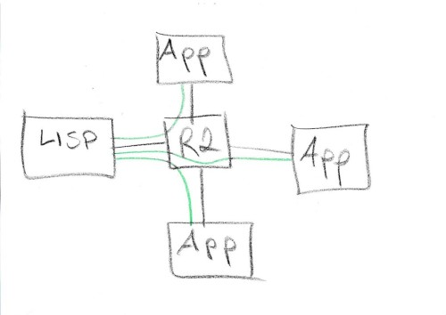
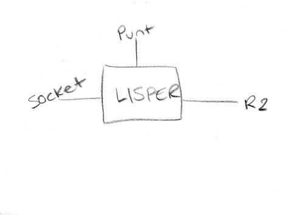
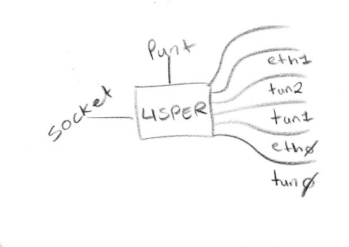
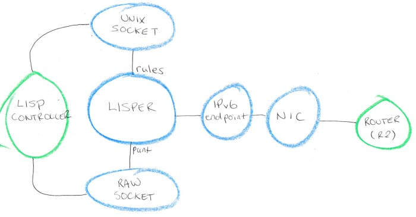
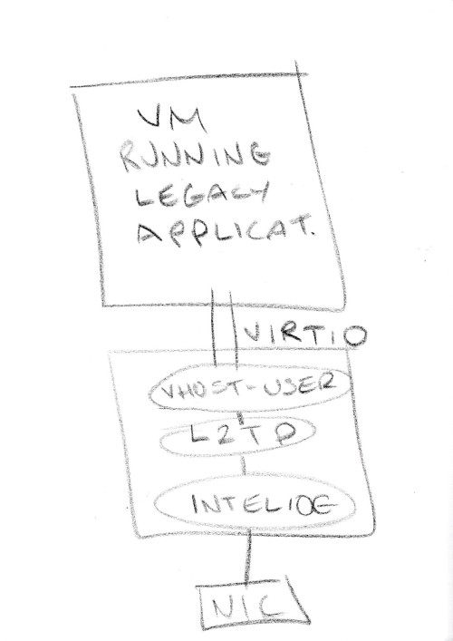

### LISPER (program.lisper)

Snabb Switch extension to support interfacing with an external control plane
for establishing L2TPv3 tunnels. The extension is suitable for use with
an external LISP (RFC 6830) controller.

#### Overview

In this diagram we have:

* LISP: the LISPER program.
* App: various applications that are connecting to LISPER.
* R2: an L3 router that connects everything together (could be one device
or e.g. the Internet).

The black lines are the physical connections: everything is connected
to the router. The green lines are the logical connections: the applications
are all connected to LISPER but not directly to each other. For the Apps
to talk with each other they send packets to LISPER that then forwards them
to the other Apps, according to a set of rules that the LISPER maintains
and that it receives from a LISP controller through a control socket.

##### LISPER

From this model we can imagine two different potential internal
structures for LISPER: a simple one targeting exactly this use case
or a more complex one that potentially handlers other use cases too.

Here LISPER has its control socket and its "punt" interface and then a single
Ethernet interface that connects to the router. The assumption here is that
we are always sending/receiving packets from one router and every packet
is L2TPv3 encapsulated. LISPER's job is to receive a packet, look at the
L2TPv3 header to see who is sending/receiving it, and then resend one
or more copies of it to the router for the destination(s) it should go to.

The more complex scenario would be to say that LISPER is connecting
multiple Layer-2 networks together and each network can be represented
either by a physical network interface or a tunnel.
So we would support any number of network interfaces, both physical
and tunnels, and that each network could have any number of machines
on it.

Below is a more detailed picture with the components of LISPER in
blue and the external systems in green:

NIC: Performance Ethernet I/O towards the router. Could be an instance
of the Intel10G app (hi-performance production mode) or the RawSocket app
(light testing mode).

IPv6 endpoint: An instance of the nd_light app that handshakes
with the router and then stamps the right DMAC address on the packets
to be sent out (so that they will be picked up by the R2).

RAW SOCKET: The "punt" interface to send packets to the LISP controller.
Packets for which LISPER doesn't have a forwarding rule will be sent
to this interface for inspection.

UNIX SOCKET: The control interface through which LISPER receives packet
forwarding rules from the LISP controller. The LISP controller sends in
forwarding rule updates through this socket periodically.

LISPER: Decapsulates incoming L2TPv3 frames, decides what to do with them
("punt" them or resend them via R2 to one or more remote L2TPv3 tunnels),
and performs encryption/decryption.

LISP CONTROLLER: An external LISP (RFC 6830) app which updates LISPER
periodically with new forwarding rules and receives packets that LISPER
would otherwise drop for inspection.

##### Apps

What we call an "App" per the first diagram is really a machine running
two layers of applications.
On top there is a virtual machine running a "legacy" networking application
that does _not_ know how to communicate over the internet/R2 and expects
to find other machines at the Ethernet level, and then below that
is our snabbnfv application that is configured to provide a transparent
point-to-point L2TPv3 tunnel that the virtual machine does not know about.

This allows deploying legacy apps inside virtual machines that require
being on the same LAN.

Here is a picture of this with QEMU VM on top and then snabbnfv process below:

Currently snabbnfv supports point-to-point tunnels between two endpoints.
So two VMs can connect to each other directly already. LISPER is needed
to create more complex topologies that require connecting more than two
machines together.

#### Setting up a dev environment

The goal is to make a dev environment that reproduces the whole network
in software using only readily-available lightweight virtual machines
and virtual interfaces.

Stay tuned.
