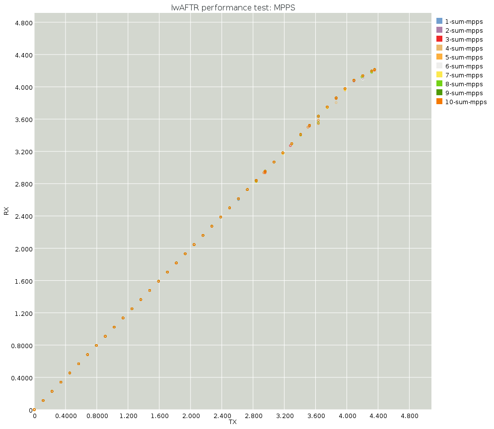
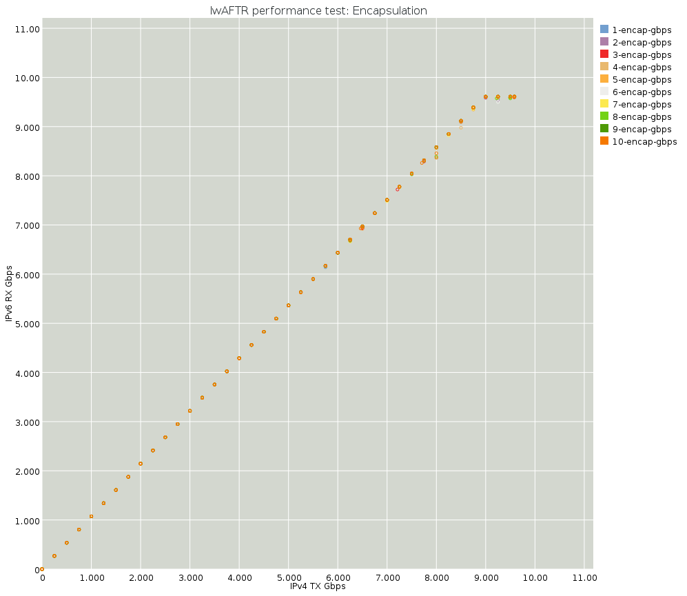
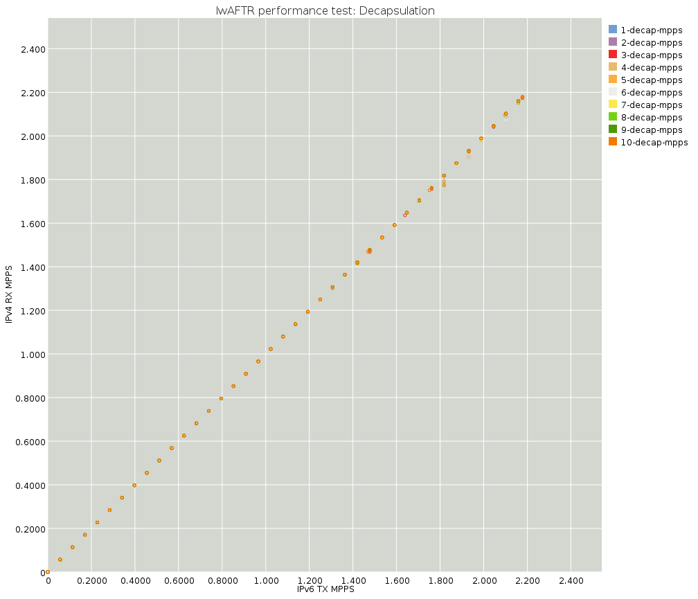

# Benchmarking

The instructions in [README.running.md](README.running.md) for running the lwaftr
 with a load generator are the instructions for the primary way to benchmark the lwaftr.

To run a load generator and a lwAFTR, you will need 4 NICs. The following 
example assumes NICs `02:00.0` and `02:00.1` and wired to NICs `02:00.0` and
`02:00.1` in a different server.

Please, change the PCI addresses to match the settings in your current system; 
See [README.running.md](README.running.md).

In one server, start the lwAFTR:

```
$ sudo numactl -m 0 taskset -c 1 ./src/snabb lwaftr run -v \
    --conf program/lwaftr/tests/data/icmp_on_fail.conf \
    --v4 0000:02:00.0 --v6 0000:02:00.1
```

See [README.performance.md](README.performance.md) for a discussion of `numactl`,
`taskset`, and NUMA settings.

The `-v` flag enables periodic printouts reporting MPPS and Gbps statistics per
NIC.

In the other server, run the `loadtest` command:

```
$ sudo numactl -m 0 taskset -c 1 ./snabb lwaftr loadtest -D 1 -b 10e9 -s 0.2e9 \
    program/lwaftr/tests/benchdata/ipv4-0550.pcap "NIC 0" "NIC 1" 02:00.0 \
    program/lwaftr/tests/benchdata/ipv6-0550.pcap "NIC 1" "NIC 0" 02:00.1
```

The loadtest command will ramp up from 0 Gbps to 10 Gbps.  At each step it measures
the return traffic from the lwAFTR, and prints out all this information
to the console.  The load generator stops when the test is done.

## Performance charts

## Version 1.0









## Version 2.x

Charts are not available at this moment.  

The 2.x release series (up to version 2.7 at this writing) fixes packet
loss for binding tables on the order of a million entries.  For example,
on a binding table with one million entries:

```
Applying 9.800000 Gbps of load.
  IPv4:
    TX 2134131 packets (2.134131 MPPS), 1173772050 bytes (9.799930 Gbps)
    RX 2037944 packets (2.037944 MPPS), 1202386960 bytes (10.010381 Gbps)
    Loss: 12 ingress drop + 96175 packets lost (4.507080%)
  IPv6:
    TX 2134131 packets (2.134131 MPPS), 1173772050 bytes (9.799930 Gbps)
    RX 2134131 packets (2.134131 MPPS), 1088406810 bytes (9.117008 Gbps)
    Loss: 0 ingress drop + 0 packets lost (0.000000%)
```

## Approximate benchmarking, without physical NICs

To get an idea of the raw speed of the lwaftr without interaction with NICs,
or check the impact of changes on a development machine that may not have
Intel 82599 NICs, `snabb lwaftr bench` may be used:

### Small binding table

```bash
$ sudo ./snabb lwaftr bench program/lwaftr/tests/data/icmp_on_fail.conf \
   program/lwaftr/tests/benchdata/ipv4-0550.pcap \
   program/lwaftr/tests/benchdata/ipv6-0550.pcap

loading compiled binding table from program/lwaftr/tests/data/binding-table.o
compiled binding table program/lwaftr/tests/data/binding-table.o is up to date.
Time (s),Decapsulation MPPS,Decapsulation Gbps,Encapsulation MPPS,Encapsulation Gbps
0.999572,2.774313,11.319198,2.774313,13.094758
1.999611,2.811008,11.468914,2.811008,13.267960
2.999599,2.811921,11.472637,2.811921,13.272266
3.999563,2.811984,11.472897,2.811984,13.272567
4.999624,2.812225,11.473878,2.812225,13.273702
5.999599,2.810681,11.467578,2.810681,13.266413
6.999649,2.809703,11.463586,2.809703,13.261796
7.999608,2.809961,11.464641,2.809961,13.263016
8.999636,2.811551,11.471128,2.811551,13.270521
9.999650,2.812866,11.476491,2.812866,13.276725
```

Note however that this approach is limited as it does not model the
memory behavior of a real lwAFTR that is connected to hardware.  For
serious performance testing, we recommend using `loadtest` on one
machine, and running the lwAFTR on another machine that is directly
cabled to the load-testing machine.
