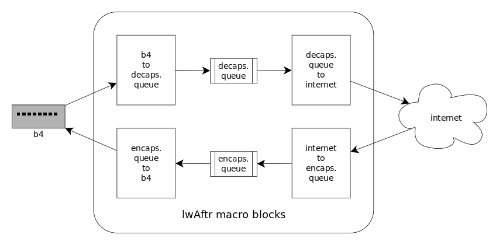
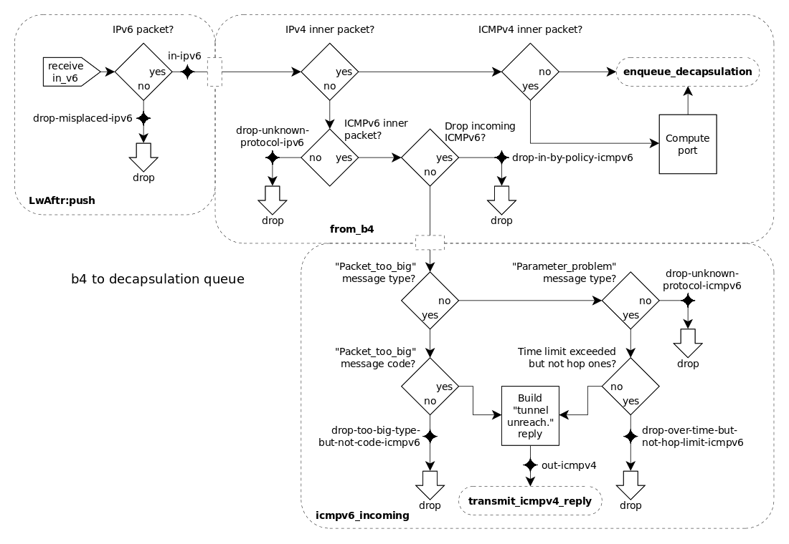
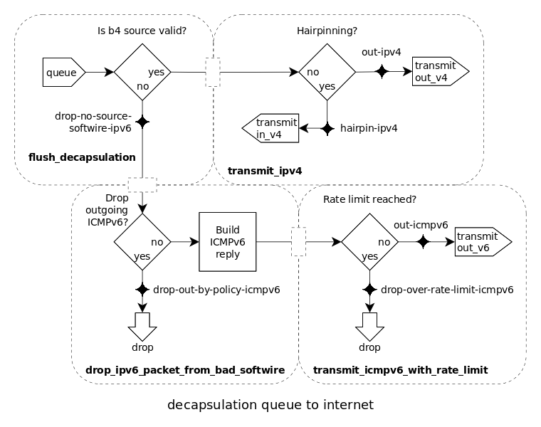
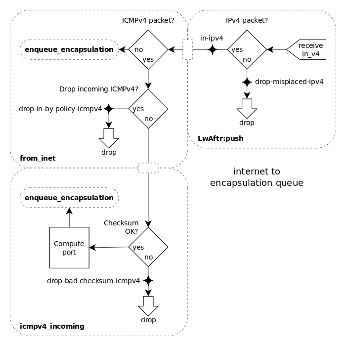
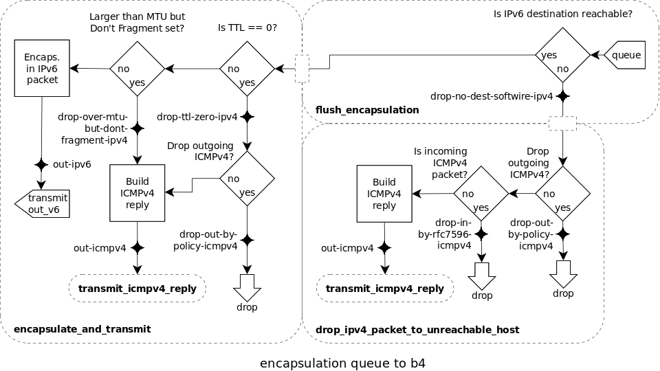

# Counters

In order to better understand the flow of packets through the lwAftr app at
runtime, a number of counters are embedded in the code. They record the
number of packets and bytes handled at various points of the execution flow,
shown in the diagrams below.

The counters' values can be accessed by means of the `snabb top` subcommand.

## Execution flow

Here is the lwAftr's overall execution flow:

Packets coming from the b4 on users' premises are decapsulated, handled, then
sent to the Internet or dropped, as appropriate. On the other side, packets
coming from the Internet are handled, possibly dropped, or encapsulated and
sent to users' b4.

Some packets coming from a b4 may be destined to another b4 handled by the same
lwAftr instance: in that case, as an optimization, they are short-circuited
("hairpinned") to their destination internally, so that they are not uselessly
routed forward and back.

Each direction is broken in two by lookup queues, in order to reduce the cost
of lookups in the binding table. The four resulting macro blocks are detailed
below, in clockwise order.

For each macro block, the place of all counters in the execution flow is first
shown graphically, then each counter is described in detail. Several counters
appear in more than one place, and the dashed blocks designate functions in
the Lua code.

### b4 to decapsulation queue

Counters:

- **drop-misplaced-not-ipv6**: non-IPv6 packets incoming on the IPv6 link
- **in-ipv6**: all valid incoming IPv6 packets
- **drop-unknown-protocol-ipv6**: packets with an unknown IPv6 protocol
- **drop-in-by-policy-icmpv6**: incoming ICMPv6 packets dropped because of
  current policy
- **out-icmpv4**: internally generated ICMPv4 error packets
- **out-ipv4**: all valid outgoing IPv4 packets
- **drop-too-big-type-but-not-code-icmpv6**: the packet's ICMP type was
  "Packet too big", but its ICMP code was not an acceptable one for this type
- **drop-over-time-but-not-hop-limit-icmpv6**: the packet's time limit was
  exceeded, but the hop limit was not
- **drop-unknown-protocol-icmpv6**: packets with an unknown ICMPv6 protocol

### decapsulation queue to Internet

Counters:

- **drop-no-source-softwire-ipv6**: no matching source softwire in the binding
  table; incremented whether or not the reason was RFC7596
- **out-ipv4**: all valid outgoing IPv4 packets
- **hairpin-ipv4**: IPv4 packets going to a known b4 (hairpinned)
- **drop-out-by-policy-icmpv6**: internally generated ICMPv6 error packets
  dropped because of current policy
- **drop-over-rate-limit-icmpv6**: packets dropped because the outgoing ICMPv6
  rate limit was reached
- **out-icmpv6**: internally generated ICMPv6 error packets

### Internet to encapsulation queue

Counters:

- **drop-in-by-policy-icmpv4**: incoming ICMPv4 packets dropped because of
  current policy
- **in-ipv4**: all valid incoming IPv4 packets
- **drop-misplaced-not-ipv4**: non-IPv4 packets incoming on the IPv4 link
- **drop-bad-checksum-icmpv4**: ICMPv4 packets dropped because of a bad
  checksum
- **drop-all-ipv4-iface**, **drop-all-ipv6-iface**: all dropped packets and
  bytes that came in over the IPv4/6 interfaces, whether or not they're
  actually IPv4/6 (they only include data about packets that go in/out over the
  wires, excluding internally generated ICMP packets)

### Encapsulation queue to b4

Counters:

- **out-ipv6**: all valid outgoing IPv6 packets
- **drop-over-mtu-but-dont-fragment-ipv4**: IPv4 packets whose size exceeded
   the MTU, but the DF (Don't Fragment) flag was set
- **drop-ttl-zero-ipv4**: IPv4 packets dropped because their TTL was zero
- **drop-out-by-policy-icmpv4**: internally generated ICMPv4 error packets
  dropped because of current policy
- **drop-no-dest-softwire-ipv4**: no matching destination softwire in the
  binding table; incremented whether or not the reason was RFC7596
- **drop-in-by-rfc7596-icmpv4**: incoming ICMPv4 packets with no destination
  (RFC 7596 section 8.1)

### Fragmentation counters

All fragmentation counters have 'frag' in the name: this reflects that they
are counters related to fragmentation. Some are counts of all the packets which
are NOT fragments. All fragmentation counters are in terms of packets, not bytes,
except for the ones which deal with the amount of RAM used (prefix `memuse-`).
The memory use counters are in bytes.

IPv4 fragmentation counters:

- If fragmentation is disabled, the only potentially non-zero IPv4 fragmentation
  counter is **drop-ipv4-frag-disabled**. If fragmentation is enabled, it
  will always be zero.
- **in-ipv4-frag-needs-reassembly**: An IPv4 fragment was received.
- **in-ipv4-frag-reassembled**: A packet was successfully reassembled from IPv4
   fragments.
- **in-ipv4-frag-reassembly-unneeded**: An IPv4 packet which was not a fragment
   was received - consequently, it did not need to be reassembled. This should
   be the usual case.
- **drop-ipv4-frag-invalid-reassembly**: Two or more IPv4 fragments were
   received, and reassembly was started, but was invalid and dropped. Causes
   include multiple fragments claiming they are the last fragment,
   overlapping fragment offsets, or the packet was being reassembled from too
   many fragments (the setting is `max_fragments_per_reassembly_packet`, and
   the default is that no packet should be reassembled from more than 40.)
- **drop-ipv4-frag-random-evicted**: Reassembling an IPv4 packet from fragments
   was in progress, but the configured amount of packets to reassemble at once
   was exceeded, so one was dropped at random. Consider increasing the setting
   `max_ipv4_reassembly_packets`.
- **out-ipv4-frag**: An outgoing packet exceeded the configured IPv4 MTU, so
   needed to be fragmented. This may happen, but should be unusual.
- **out-ipv4-frag-not**: An outgoing packet was small enough to pass through
  unfragmented - this should be the usual case.
- **memuse-ipv4-frag-reassembly-buffer**: The amount of memory being used by
  the statically sized data structure for reassembling IPv4 fragments. This is
  directly proportional to the setting `max_ipv4_reassembly_packets`.

IPv6 fragmentation counters:

- If fragmentation is disabled, the only potentially non-zero IPv6 fragmentation
  counter is **drop-ipv6-frag-disabled**. If fragmentation is enabled, it
  will always be zero.
- **in-ipv6-frag-needs-reassembly**: An IPv6 fragment was received
- **in-ipv6-frag-reassembled**: A packet was successfully reassembled from IPv6
   fragments
- **in-ipv6-frag-reassembly-unneeded**: An IPv6 packet which was not a fragment
   was received - consequently, it did not need to be reassembled. This should
   be the usual case.
- **drop-ipv6-frag-invalid-reassembly**: Two or more IPv6 fragments were
   received, and reassembly was started, but was invalid and dropped. Causes
   include multiple fragments claiming they are the last fragment,
   overlapping fragment offsets, or the packet was being reassembled from too
   many fragments (the setting is `max_fragments_per_reassembly_packet`, and
   the default is that no packet should be reassembled from more than 40.)
- **drop-ipv6-frag-random-evicted**: Reassembling an IPv6 packet from fragments
   was in progress, but the configured amount of packets to reassemble at once
   was exceeded, so one was dropped at random. Consider increasing the setting
   `max_ipv6_reassembly_packets`.
- **out-ipv6-frag**: An outgoing packet exceeded the configured IPv6 MTU, so
   needed to be fragmented. This may happen, but should be unusual.
- **out-ipv6-frag-not**: An outgoing packet was small enough to pass through
  unfragmented - this should be the usual case.
- **memuse-ipv6-frag-reassembly-buffer**: The amount of memory being used by
  the statically sized data structure for reassembling IPv6 fragments. This is
  directly proportional to the setting `max_ipv6_reassembly_packets`.

## Troubleshooting using counters

- Is the lwAftr getting packets? See `in-ipv4-packets` and `in-ipv6-bytes`.
  If those are zero, it is not: check physical cabling and VLAN settings.
  Other troubleshooting steps may also apply, such as IOMMU settings: see
  `src/program/lwaftr/doc/README.troubleshooting.md`.
- Are the fragmentation counters indicating needing fragmentation and
  reassembly large? If `in-ipv4-frag-needs-reassembly` or
  `in-ipv6-frag-needs-reassembly` are large, ask why there are so many fragments
  reaching the lwAftr. If `out-ipv4-frag` or `out-ipv6-frag` are large, ask
  why the lwAftr needs to fragment so many outgoing packets, and check the
  settings `ipv4_mtu` and `ipv6_mtu` in the settings.
- Are `drop-ipv6-frag-random-evicted` or `drop-ipv4-frag-random-evicted` high?
  Consider increasing the settings `max_ipv4_reassembly_packets` and/or
  `max_ipv6_reassembly_packets`, and/or sending us a note.
- Are `drop-no-dest-softwire-ipv4` or `drop-no-source-softwire-ipv6` high?
  Check that the lwAftr's binding table matches your expectations.
  (Try `snabb lwaftr control [pid] dump-configuration`, then checking /tmp).

## Notes

Internally generated ICMPv4 error packets that are dropped because of policy
are not recorded as dropped: only incoming ICMP packets are. ("Policy" means
the configuration settings on whether to allow or drop incoming and outgoing
ICMPv4 and ICMPv6 packets, such as `policy_icmpv4_incoming = ALLOW`.)

Implementation detail: counters can be accessed as files in the runtime
area of the Snabb process, typically under
`/var/run/snabb/[PID]/app/lwaftr/`. Most of them are represented by
two files, ending with the `bytes` and `packets` suffixes.

Note that all counters only see packets without VLAN tags, so the total number
of bytes will be 2 bytes smaller than expected per packet on networks with VLANs.

Both 'in' and 'out' in counter names are relative to the lwAftr software, not a
network: a packet can come in from a B4 and out to the internet, or vice versa.
The overall counters on incoming and outgoing packets, such as `in-ipv6-bytes`,
are relative to the core lwAftr functionality, not the wire: things like ARP
and NDP that aren't handled by the core lwAftr logic are excluded, and it deals
with logical packets that have already been reassembled (if incoming) or have
not yet been fragmented (if outgoing).
