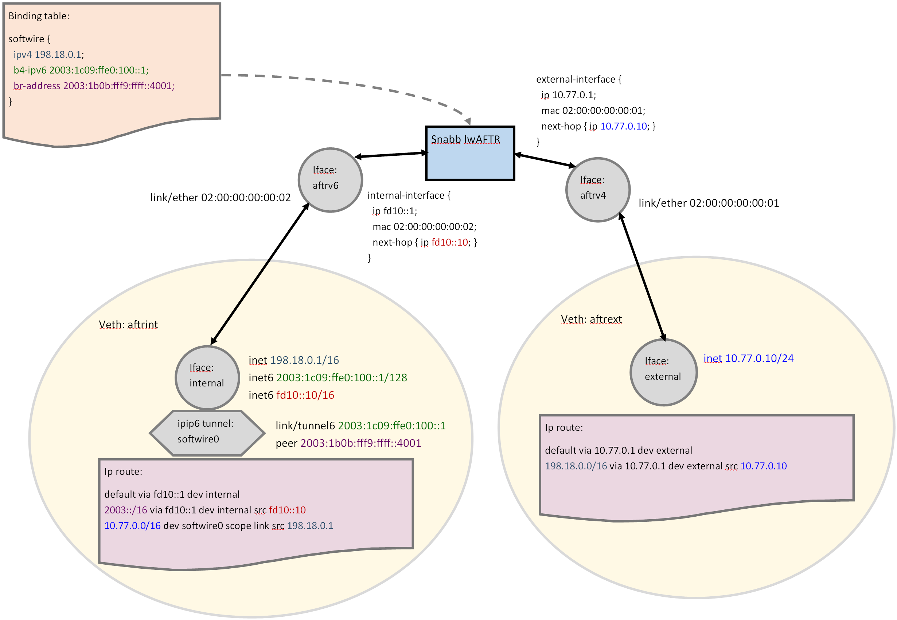

# Getting Started with Snabb lwAFTR

## Installation

Clone the Snabb repository to get the latest [release](https://github.com/snabbco/snabb/releases/):

```
$ git clone https://github.com/snabbco/snabb.git
```

If you don’t have `git` you can also download a Zip archive or Tarball of the latest release and unpack that.

Next compile Snabb by running

```
$ cd snabb # where you cloned or unpacked Snabb
$ make
... # a bunch of output that you should be able to safely ignore
BINARY    5.4M snabb # this should be the second-last line of output and indicates success
```

The result should be a Snabb executable located at `src/snabb`.
You can copy this binary to any location of your choosing, or execute from there as it is.

## Configuring lwAFTR

To run Snabb lwAFTR you need an initial configuration file.
You can find a minimal, commented example configuration to adapt to your needs here:
[src/program/lwaftr/doc/tutorial/lwaftr-start.conf](lwaftr-start.conf)

For a complete documentation of Snabb lwAFTR configuration refer to its [YANG schema](https://github.com/snabbco/snabb/blob/master/src/lib/yang/snabb-softwire-v3.yang).

## Running Snabb lwAFTR

You can test the Snabb executable you compiled by running
```
$ sudo src/snabb lwaftr run --help
```
which should print a listing of available command line options for Snabb lwAFTR.

> Note that Snabb always needs to be run with superuser privileges, hence we use "sudo".
> This is because Snabb directly accesses network hardware, bypassing the Linux OS.

To run Snabb lwAFTR for real, copy the example configuration [src/program/lwaftr/doc/tutorial/lwaftr-start.conf](lwaftr-start.conf) and save it as `lwaftr-start.conf`.
You probably need to edit at least the `device` and `external-device` statements for the configuration to apply
to your system.

You can then run Snabb lwAFTR like so:

```
$ sudo src/snabb lwaftr run --name "my-lwaftr" --cpu 12-23 --conf lwaftr-start.conf
```

The command line options mean:

 - `--name`: a name for this lwAFTR process used to refer to it in supporting programs: `snabb config get/set/get-state`
 - `--cpu`: a CPU core range used by lwAFTR
 - `--conf`: file from which to read the initial configuration

## Supporting programs: snabb config get/set/get-state

### snabb config get

You can use `snabb config get` to query the current configuration of a running Snabb lwAFTR instance.
In its simplest form you would do the following:

```
$ sudo src/snabb config get my-lwaftr /
```

The command line arguments are explained as follows:

- `my-lwaftr` is the name of the Snabb lwAFTR instance (see `--name` in _“Running Snabb lwAFTR”_)
- `/` is the YANG xpath used for the query (`/` designates the root, meaning the whole configuration)

Note that by default Snabb lwAFTR exposes the [ietf-softwire-br](https://datatracker.ietf.org/doc/html/draft-ietf-softwire-yang-16#section-7) Schema (translated from/to our native schema).
If you want to query or configure Snabb lwAFTR using its native YANG schema [snabb-softwire-v3](https://github.com/snabbco/snabb/blob/master/src/lib/yang/snabb-softwire-v3.yang) you need to request to use this schema explicitly via `--schema snabb-softwire-v3`. For example:

```
$ sudo src/snabb config get --schema snabb-softwire-v3 testaftr /softwire-config/instance[device="aftrv6"]

external-device aftrv4;
queue {
  id 0;
  external-interface {
    ip 10.77.0.1;
    mac 02:00:00:00:00:01;
    next-hop {
      ip 10.77.0.10;
    }
  }
  internal-interface {
    ip fd10::1;
    mac 02:00:00:00:00:02;
    next-hop {
      ip fd10::10;
    }
  }
}
```

### snabb config set

You can use `snabb config set` to change the configuration of a running Snabb lwAFTR instance.
The arguments behave like `config get`, with the addition of an argument following the xpath which is the value to substitute at the specified location.
For example, you could update the encapsulation flow label of the Snabb lwAFTR instance _testaftr_ like so:

```
$ sudo src/snabb config set --schema snabb-softwire-v3 testaftr /softwire-config/internal-interface/flow-label 1234
```

You can also replace the whole configuration at once (if the value argument is omitted, it will be read from standard input):

```
$ sudo src/snabb config set --schema snabb-softwire-v3 testaftr / < src/program/lwaftr/doc/tutorial/lwaftr-start.conf
```

It is also possible to change portions of the configuration:

```
$ sudo src/snabb config set --schema snabb-softwire-v3 testaftr /softwire-config/instance[device="aftrv6"]/queue[id="0"]/internal-interface <<EOF

ip fd10::1;
mac 02:00:00:00:00:02;
next-hop {
  ip fd10::10;
}
EOF
```

### snabb config get-state

You can use `snabb config get-state` to query statistics counters collected by a running Snabb lwAFTR instance.
For example:

```
$ sudo src/snabb config get-state --schema snabb-softwire-v3 testaftr /softwire-state
discontinuity-time 2022-08-11T11:21:52Z;
drop-all-ipv4-iface-bytes 0;
drop-all-ipv4-iface-packets 0;
drop-all-ipv6-iface-bytes 0;
drop-all-ipv6-iface-packets 0;
…
```

You should see counters for ICMP, ARP, and ND traffic towards Snabb lwAFTR,
as well as counters for routed packets: `in-ipv4-packets`, `out-ipv6-packets`,
`in-ipv6-packets`, and `out-ipv4-packets`.
Packets that could not be routed will be counted in various `drop-*` counters.

## Example: testing Snabb lwAFTR within a virtual Linux network namespace

You can try out Snabb lwAFTR on virtual Linux interfaces.
There is an example setup described in [src/program/lwaftr/doc/tutorial/lwaftr-veth-env.sh](lwaftr-veth-env.sh).
Read the script to understand the setup, I promise it is not overly complicated.

Use can use this script to create an two Linux network namespaces simulating
an internal and an external network bridged by Snabb lwAFTR using the example
configuration [src/program/lwaftr/doc/tutorial/lwaftr-start.conf](lwaftr-start.conf).



To create the tutorial environment:
```
$ sudo src/program/lwaftr/doc/tutorial/lwaftr-veth-env.sh create
```

You can get a listing of some example commands to run in this environment by calling:
```
$ sudo src/program/lwaftr/doc/tutorial/lwaftr-veth-env.sh examples
```

Let’s start Snabb lwAFTR to bridge between the two virtual networks of the tutorial environment:
```
$ sudo src/snabb lwaftr run --name testaftr --conf src/program/lwaftr/doc/tutorial/lwaftr-start.conf &
[1] 3059442
src/program/lwaftr/doc/tutorial/lwaftr-start.conf: loading compiled configuration from src/program/lwaftr/doc/tutorial/lwaftr-start.conf.o
src/program/lwaftr/doc/tutorial/lwaftr-start.conf: compiled configuration is up to date.
Migrating instance 'aftrv4' to 'aftrv6'
No CPUs available; not binding to any NUMA node.
Warning: No assignable CPUs declared; leaving data-plane PID 3059443 without assigned CPU.
NDP: Resolving 'fd10::10'
ARP: Resolving '10.77.0.10'
NDP: 'fd10::10' resolved (a2:49:90:f5:9f:14)
ARP: '10.77.0.10' resolved (6e:c4:13:b0:2f:30)
```

You can ping the Snabb lwAFTR instance from the private network...
```
$ sudo ip netns exec aftrint ping -c 1 fd10::1
PING fd10::1(fd10::1) 56 data bytes
64 bytes from fd10::1: icmp_seq=1 ttl=64 time=0.164 ms

--- fd10::1 ping statistics ---
1 packets transmitted, 1 received, 0% packet loss, time 0ms
rtt min/avg/max/mdev = 0.164/0.164/0.164/0.000 ms
```

...and the public network:
```
$ sudo ip netns exec aftrext ping -c 1 10.77.0.1
PING 10.77.0.1 (10.77.0.1) 56(84) bytes of data.
64 bytes from 10.77.0.1: icmp_seq=1 ttl=64 time=0.207 ms

--- 10.77.0.1 ping statistics ---
1 packets transmitted, 1 received, 0% packet loss, time 0ms
rtt min/avg/max/mdev = 0.207/0.207/0.207/0.000 ms
```

Let’s use `tcpdump` to observe traffic on our internal and external networks:
```
$ sudo ip netns exec aftrint tcpdump -nn -i internal -l --immediate-mode &
[2] 1797194
tcpdump: verbose output suppressed, use -v or -vv for full protocol decode
listening on internal, link-type EN10MB (Ethernet), capture size 262144 bytes
```

```
$ sudo ip netns exec aftrext tcpdump -nn -i external -l --immediate-mode &
[3] 3100921
tcpdump: verbose output suppressed, use -v or -vv for full protocol decode
listening on external, link-type EN10MB (Ethernet), capture size 262144 bytes
```

We can ping a node on the internal network from the external network to observe
encapsulation and address translation:
```
$ sudo ip netns exec aftrext ping -c 1 -W 1 198.18.0.1
PING 198.18.0.1 (198.18.0.1) 56(84) bytes of data.
14:46:35.450610 IP 10.77.0.10 > 198.18.0.1: ICMP echo request, id 33776, seq 1, length 64
14:46:35.450889 IP6 2003:1b0b:fff9:ffff::4001 > 2003:1c09:ffe0:100::1: IP 10.77.0.10 > 198.18.0.1: ICMP echo request, id 33776, seq 1, length 64
14:46:35.450936 IP6 2003:1c09:ffe0:100::1 > 2003:1b0b:fff9:ffff::4001: IP 198.18.0.1 > 10.77.0.10: ICMP echo reply, id 33776, seq 1, length 64
14:46:35.453038 IP 198.18.0.1 > 10.77.0.10: ICMP echo reply, id 33776, seq 1, length 64
64 bytes from 198.18.0.1: icmp_seq=1 ttl=64 time=2.44 ms

--- 198.18.0.1 ping statistics ---
1 packets transmitted, 1 received, 0% packet loss, time 0ms
rtt min/avg/max/mdev = 2.440/2.440/2.440/0.000 ms
```

You can see the plain IPv4 packet on the external network:
```
14:46:35.450610 IP 10.77.0.10 > 198.18.0.1: ICMP echo request, id 33776, seq 1, length 64
```
How it is encapsulated, and its encapsulated response, on the internal network:
```
14:46:35.450889 IP6 2003:1b0b:fff9:ffff::4001 > 2003:1c09:ffe0:100::1: IP 10.77.0.10 > 198.18.0.1: ICMP echo request, id 33776, seq 1, length 64
14:46:35.450936 IP6 2003:1c09:ffe0:100::1 > 2003:1b0b:fff9:ffff::4001: IP 198.18.0.1 > 10.77.0.10: ICMP echo reply, id 33776, seq 1, length 64
```
And finally the response being decapsulated on the external network:
```
14:46:35.453038 IP 198.18.0.1 > 10.77.0.10: ICMP echo reply, id 33776, seq 1, length 64
```

You can also ping a node on the external network from the endpoint in the internal network.
```
$ sudo ip netns exec aftrint ping -c 1 10.77.0.10
PING 10.77.0.10 (10.77.0.10) 56(84) bytes of data.
15:01:27.823746 IP6 2003:1c09:ffe0:100::1 > 2003:1b0b:fff9:ffff::4001: IP 198.18.0.1 > 10.77.0.10: ICMP echo request, id 27804, seq 1, length 64
15:01:27.823990 IP 198.18.0.1 > 10.77.0.10: ICMP echo request, id 27804, seq 1, length 64
15:01:27.824015 IP 10.77.0.10 > 198.18.0.1: ICMP echo reply, id 27804, seq 1, length 64
15:01:27.824814 IP6 2003:1b0b:fff9:ffff::4001 > 2003:1c09:ffe0:100::1: IP 10.77.0.10 > 198.18.0.1: ICMP echo reply, id 27804, seq 1, length 64
64 bytes from 10.77.0.10: icmp_seq=1 ttl=63 time=1.09 ms

--- 10.77.0.10 ping statistics ---
1 packets transmitted, 1 received, 0% packet loss, time 0ms
rtt min/avg/max/mdev = 1.094/1.094/1.094/0.000 ms
```

Furthermore, let’s look at statistics counters collected by Snabb lwAFTR.
How many IPv6 frames did Snabb lwAFTR send?

```
$ sudo src/snabb config get-state -s snabb-softwire-v3 testaftr /softwire-state/out-ipv6-packets
2
```

Two? Yep, one encapsulated ICMP request and one reply (`10.77.0.10 > 198.18.0.1`).

Finally, let’s tidy up and tear down our test environment:
```
$ fg
sudo ip netns exec aftrext tcpdump -nn -i external -l --immediate-mode
^C
8 packets captured
8 packets received by filter
0 packets dropped by kernel

$ fg
sudo ip netns exec aftrint tcpdump -nn -i internal -l --immediate-mode
^C
16 packets captured
16 packets received by filter
0 packets dropped by kernel
$ fg

sudo src/snabb lwaftr run --name testaftr --v6 aftrv6 --v4 aftrv4 --conf src/program/lwaftr/doc/tutorial/lwaftr-start.conf
^C

$ sudo src/program/lwaftr/doc/tutorial/lwaftr-veth-env.sh destroy
+ ip netns delete aftrint
+ ip link delete aftrv6
+ ip netns delete aftrext
+ ip link delete aftrv4
```