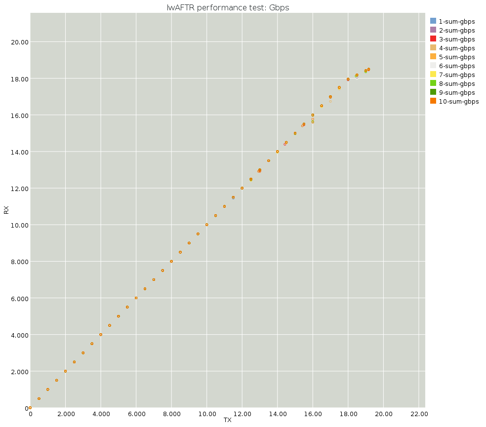
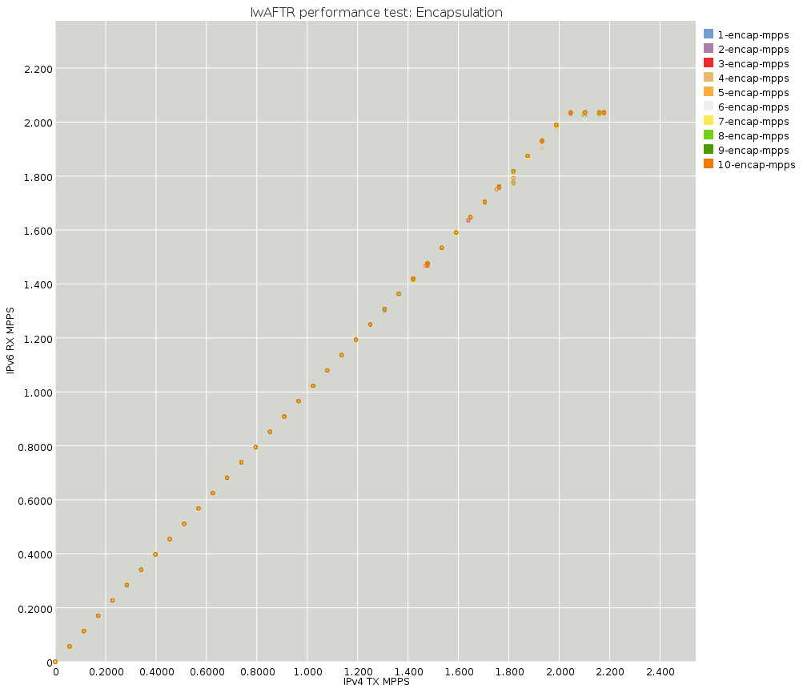

# Benchmarking

The instructions in [README.first.md](README.first.md) for running the lwaftr with a load
generator are the instructions for the primary way to benchmark the lwaftr.
In short:

To run a load generator and an lwaftr, you will need four interfaces. The
following example assumes that `01:00.0` is cabled to `01:00.1`, and that
`02:00.0` is cabled to `02:00.1`. Change the concrete pci devices specified to
match the current system; See [README.first.md](README.first.md).

First, start the lwAFTR:

```
$ sudo ./src/snabb-lwaftr run \
    --bt tests/apps/lwaftr/data/binding.table \
    --conf tests/apps/lwaftr/data/icmp_on_fail.conf \
    --v4-pci 0000:01:00.1 --v6-pci 0000:02:00.1
```

The lwAFTR won't print out much to the console.  You can pass the `-v`
flag to enable periodid printouts if you like.

Then run a load generator:

```
$ sudo ./src/snabb-lwaftr transient  \
    tests/apps/lwaftr/benchdata/ipv4-0550.pcap IPv4 0000:01:00.0 \
    tests/apps/lwaftr/benchdata/ipv6-0550.pcap IPv6 0000:02:00.0 \
```

By varying the `--v4-pcap` and `--v6-pcap` arguments, the performance of the
lwaftr can be benchmarked with different types of loads.

The contents of the pcap file are fed repeatedly through each NIC, to the
lwaftr, by the load generator.

## NUMA

Each NIC is associated with a NUMA node.  For systems with multiple NUMA
nodes, usually if you have more than one socket, you will need to ensure
that the processes that access NICs do so from the right NUMA node.

For example if you are going to be working with NICs `0000:01:00.0`,
`0000:01:00.1`, `0000:02:00.0`, and `0000:02:00.1`, check:

```bash
$ for device in 0000:0{1,2}:00.{0,1}; do \
    echo $device; cat /sys/bus/pci/devices/$device/numa_node; \
  done
0000:01:00.0
0
0000:01:00.1
0
0000:02:00.0
0
0000:02:00.1
0
```

So all of these are on NUMA node 0.  Then check your CPUs:

```
$ numactl -H | grep cpus
node 0 cpus: 0 1 2 3 4 5
node 1 cpus: 6 7 8 9 10 11
```

So for these we should run our binaries under `taskset -c CPU` to bind
them to CPUs in the NUMA node 0.

## Current performance







## Approximate benchmarking, without physical NICs

To get an idea of the raw speed of the lwaftr without interaction with NICs,
or check the impact of changes on a development machine that may not have
Intel 82599 NICs, `snabb-lwaftr bench` may be used:

```bash
$ sudo ./snabb-lwaftr bench \
    ../tests/apps/lwaftr/data/binding.table \
    ../tests/apps/lwaftr/data/icmp_on_fail.conf \
    ../tests/apps/lwaftr/benchdata/ipv4-0550.pcap \
    ../tests/apps/lwaftr/benchdata/ipv6-0550.pcap
statisticsv6: 4.246 MPPS, 20.043 Gbps.
statisticsv4: 4.246 MPPS, 17.325 Gbps.
statisticsv6: 4.237 MPPS, 19.999 Gbps.
statisticsv4: 4.237 MPPS, 17.287 Gbps.
statisticsv6: 4.266 MPPS, 20.133 Gbps.
statisticsv4: 4.266 MPPS, 17.403 Gbps.
statisticsv6: 4.238 MPPS, 20.002 Gbps.
statisticsv4: 4.238 MPPS, 17.290 Gbps.
statisticsv6: 4.149 MPPS, 19.584 Gbps.
statisticsv4: 4.149 MPPS, 16.928 Gbps.
```

The processing is not limited to 10 Gbps, as no NIC hardware is involved.
