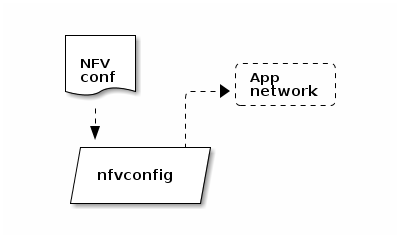

### NFV config (program.snabbnfv.nfvconfig)

The `program.snabbnfv.nfvconfig` module implements a [Network Functions
Virtualization](https://en.wikipedia.org/wiki/Network_Functions_Virtualization)
component based on Snabb Switch. It introduces a simple configuration
file format to describe NFV configurations which it then compiles to app
networks. This NFV component is compatible with [OpenStack
Neutron](https://wiki.openstack.org/wiki/Neutron).



— Function **nfvconfig.load** *file*, *pci_address*, *socket_path*

Loads the NFV configuration from *file* and compiles an app network using
*pci_address* and *socket_path* for the underlying `Intel10G` and
`VhostUser` apps. Returns the resulting engine configuration and
*zerocopy pairs*.

— Function **nfvconfig.apply** *config*, *zerocopy*

Configures the engine to use *config* and assign *zerocopy* pairs. Uses
`engine.configure()` internally.

#### NFV Configuration Format

The configuration file format understood by `program.snabbnfv.nfvconfig`
is based on *Lua expressions*. Initially, it contains a list of NFV
*ports*:

```
return { <port-1>, ..., <port-n> }
```

Each port is defined by a range of properties which correspond to the
configuration parameters of the underlying apps (`Intel10G`, `VhostUser`,
`PacketFilter`, `RateLimiter`, `nd_light` and `SimpleKeyedTunnel`):

```
port := { port_id        = <id>,          -- A unique string
          mac_address    = <mac-address>, -- As for Intel10G
          vlan           = <vlan-id>,     -- ..
          ingress_filter = <rules>,       -- As for PacketFilter
          egress_filter  = <rules>,       -- ..
          tunnel         = <tunnel-conf>,
          rx_police_gbps = <n>,           -- Allowed input rate in Gbps
          tx_police_gbps = <n> }          -- Allowed output rate in Gbps
```

The `tunnel` section deviates a little from `SimpleKeyedTunnel`'s
terminology:

```
tunnel := { type          = "L2TPv3",     -- The only type (for now)
            local_cookie  = <cookie>,     -- As for SimpleKeyedTunnel
            remote_cookie = <cookie>,     -- ..
            next_hop      = <ip-address>, -- Gateway IP
            local_ip      = <ip-address>, -- ~ `local_address'
            remote_ip     = <ip-address>, -- ~ `remote_address'
            session       = <32bit-int>   -- ~ `session_id' }
```

### snabbnfv traffic

The `snabbnfv traffic` program loads and runs a NFV configuration using
`program.snabbnfv.nfvconfig`. It can be invoked like so:

```
./snabb snabbnfv traffic <file> <pci-address> <socket-path>
```

`snabbnfv traffic` runs the loaded configuration indefinitely and
automatically reloads the configuration file if it changes (at most once
every second).

### snabbnfv neutron2snabb

The `snabbnfv neutron2snabb` program converts Neutron database CSV dumps
to the format used by `program.snabbnfv.nfvconfig`. For more info see
[Snabb NFV Architecture](https://github.com/SnabbCo/snabb-nfv/wiki/Architecture).
It can be invoked like so:

```
./snabb snabbnfv neutron2snabb <csv-directory> <output-directory> [<hostname>]
```

`snabbnfv neutron2snabb` reads the Neutron configuration *csv-directory*
and translates them to one `lib.nfv.conig` configuration file per
physical network. If *hostname* is given, it overrides the hostname
provided by `hostname.1`.
