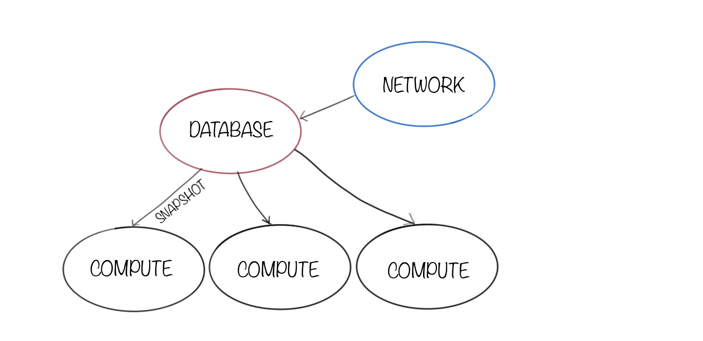
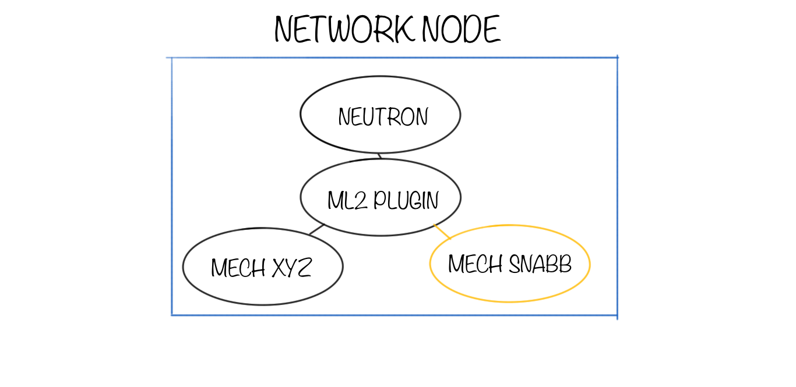
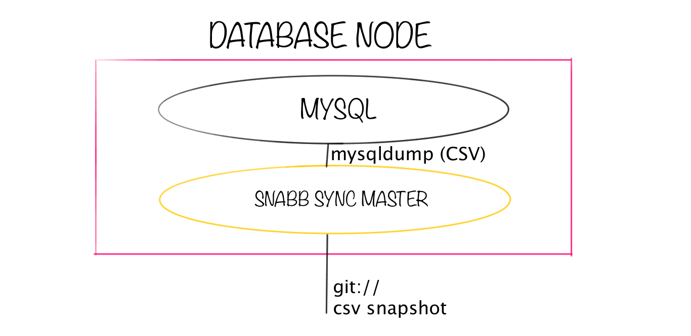
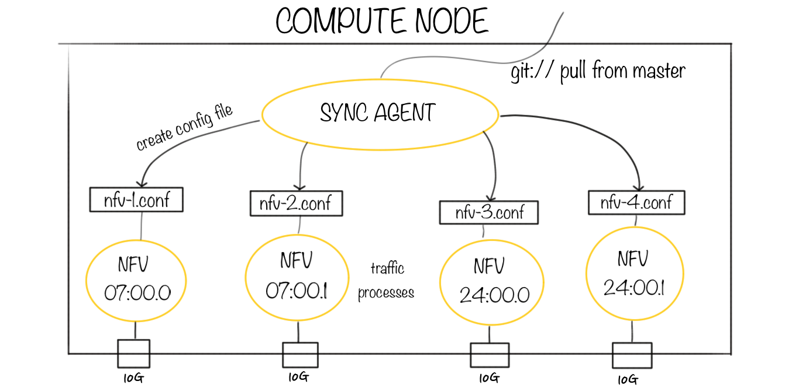

# Snabb NFV Architecture

[Snabb NFV](http://snabb.co/nfv.html) is deployed for OpenStack with
components on the Network Node, the Database Node, and the Compute
Nodes. 

The design goal is to distribute a consistent snapshot of the Neutron
network configuration to every node at a reasonable interval (e.g. once
per second) and to behave in a reasonable and predictable way when any
node fails, restarts, or slows down.

## Network node

The **Snabb NFV ML2 Mechanism Driver** is deployed on the Network
Node. This is a Python module that runs inside OpenStack Neutron. The
Snabb mechanism driver implements *port binding* to assign selected ports
to Snabb NFV. You can also run other mechanism drivers in parallel and
bind other ports to those.

The Snabb NFV mechanism driver is most similar to the OpenDaylight
mechanism driver.

## Database node

The **Snabb NFV Sync Master** runs on the database node. This daemon
periodically captures a consistent snapshot of the Neutron configuration
and makes it available for synchronization over the network.

The sync master is implemented by a shell script called
[neutron-sync-master](https://github.com/SnabbCo/snabbswitch/tree/master/src/program/snabbnfv/neutron_sync_master).
The database is periodically snapshotted into CSV files with `mysqldump`
and published for synchronization using `git`. The snapshot interval is
configurable and defaults to once per second.

## Compute node

Each compute node runs the Sync Agent and one or more Traffic processes.

The **Snabb NFV Sync Agent** periodically polls the Sync Master for an
updated Neutron configuration. Each time the Neutron configuration
changes the Sync Agent generates new configuration files for each of the
Snabb NFV Traffic processes that are affected.

The sync agent is a shell script called
[neutron-sync-agent](https://github.com/SnabbCo/snabbswitch/tree/master/src/program/snabbnfv/neutron_sync_agent)
and uses the
[neutron2snabb](https://github.com/SnabbCo/snabbswitch/tree/master/src/program/snabbnfv/neutron2snabb)
program to translate the master Neutron configuration into individual
configuration files for each local traffic process.

Each **Snabb NFV Traffic** process performs packet processing between one
physical network port (PCI device) and all of the virtual machines
connected to that port. Each traffic process loads its configuration from
an individual file in its own native format. When the configuration file
changes the traffic process automatically loads the new version. Each
traffic process is identified by the PCI address of the network device
that it operates, for example `07:00.0`.

For the standard high-performance deployment scenario each traffic
process runs on a dedicated CPU core. For peak performance the traffic
process should be assigned a CPU core and PCI network device that both
belong to the same NUMA node.
