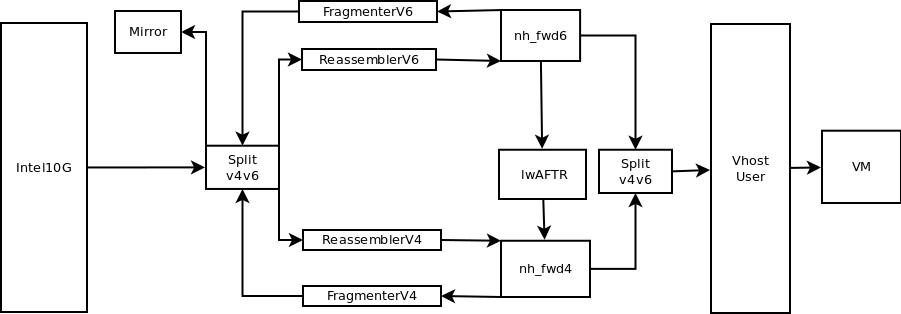

### SnabbVMX

SnabbVMX is a network design that combines Snabb's lwAFTR app and a VM managed by Snabb.

Snabb's lwAFTR app, in addition to managing lw4o6 traffic (IPv4 and IPv6 packets),
it also manages non-lwAFTR traffic such as pings to lwAFTR interfaces, ARP and
NDP resolution.  This traffic is managed by addition applications connected to
the lwAFTR network design in program/lwaftr/run.lua.  Management of this type
of traffic is a requiremennt in RFC 7596.

SnabbVMX uses a different approach.  It setups a network design where only lw4o6
packets are managed by the lwAFTR app, while everything else is forwarded to a VM
which is in charge of providing ping, ARP and NDP resolution.

#### App network

SnabbVMX's app network:



SnabbVMX works in one single 10Gb NIC.  Incoming traffic gets to an Intel82599 app
managed by Snabb.

App V4V6 splits traffic between IPv4 or IPv6 and forwards it to the correspondent
Reassembler app.  Let's take IPv4 traffic flow as example. ReassemblerV4 forwards
packets to a Next Hop Forwarder app.  This app decides whether to forward traffic
to the lwAFTR app or to the VM, based on unicast/broadcast destination MAC,
matching local IPv4 destination or IPv4-in-IPv6.

App VhostUser communicates with a VM run by QEMU using the VhostUser network
backend available in QEMU.  Communication between both processes happens via a
socket.

App V4V6, in combination with a Tap app, allows monitoring of packets coming
in and out of the physical port based on a matching IPv4 address, either as
source, destination or within an IPv4-in-IPv6 packet.

#### How to run SnabbVMX

```
    $ sudo ./snabb snabbvmx lwaftr --id SnabbVMX1   \
        --conf snabbvmx-lwaftr.cfg                  \
        --pci 81:00.0                               \
        --mac 02:AA:AA:AA:AA:AA                     \
        --sock /tmp/vhuser.sock
```

#### Configuration file

`snabbvmx-lwaftr.cfg`

```
return {
   lwaftr = "snabbvmx-lwaftr.conf",
   ipv6_interface = {
     cache_refresh_interval = 1,
   },
   ipv4_interface = {
     ipv4_address = "10.0.1.1",
     cache_refresh_interval = 1,
   },
   settings = {
      vlan = false,
   },
}
```

lwaftr points to Snabb's lwAFTR configuration file.

Othe attributes are further refined by SnabbVMX.  Attributes `ipv6_interface`
and `ipv4_interface` are mandatory and ipv4_interface must include the IP addresses
of the correspondent lwAFTR IPv4 interfaces. The IPv4 address is used to send matching
packets to the VMX instead of trying to find a match in the binding table for encap.

Attribute `settings` may include a `vlan` tag attribute, which can be either
false in case VLAN tagging is not enabled or a VLAN tag number (0-4095).

Reassembly and fragmentation are deactivated by default in SnabbVMX.  In case
they are needed, set `ipv6_interface.fragmentation = true`.

Interfaces also allow setting of IPv4 and IPv6 ingress/egree filters.  The
filters are expessed as a packet-filtering expression (like tcpdump) or point
to a file containing a pf expression.

#### Components overview

List of apps used in SnabbVMX network design:

* **V4V6** (`apps/lwaftr/V4V6.lua`):  Categorizes traffic as IPv4 and IPv6 and
forwards it to the correspondent link.
* **Tap** (`apps/tap/tap.lua`):  Used to monitor traffic in V4V6 via a Tap interface.
Matching IPv4 address is controlled by "lwaftr snabbvmx monitor".
* **ReassemblerV6**/**FragmenterV6** (`apps/lwaftr/ipv6_apps.lua`):  IPv6 reassembler and
fragmenter apps.
* **ReassemblerV4**/**FragmenterV4** (`apps/lwaftr/ipv4_apps.lua`):  IPv6 reassembler and
fragmenter apps.
* **Next-hop Forwarder** (`apps/nh_fwd/nh_fwd.lua`): It contains to forwarding apps:
nh_fwd6 and nh_fwd4.  The apps forwards incoming traffic to a service, in this
case to a lwAFTR app, and to a VM.  Routing decisions are based on next-hop
MAC address learned from the VM and by IP destination address of incoming
packets.
* **lwAFTR** (`apps/lwaftr/lwaftr.lua`):  Implements a lwAFTR component as specified
in RFC7569.
* **VhostUser** (`apps/vhost/vhost_user.lua`):  A driver complying Virtio which allows
a program in user space, in this case Snabb, to act as an hypervisor of the
networking side of a guest.  Similarly, the guest side has to be managed by a
VhostUser network backend (already built-in in QEMU).
